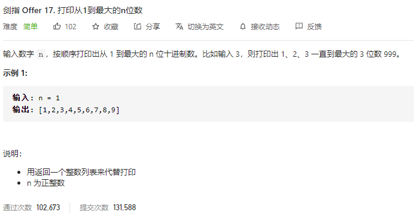

### 剑指offer_17_easy_打印从1到最大的n位数



```c++
class Solution {
public:
    vector<int> printNumbers(int n) {

    }
};
```

#### 算法思路

```c++
class Solution {
public:
    vector<int> printNumbers(int n) {
        int i,maxNum;
        vector<int> result;

        maxNum=pow(10,n);
        for(i=1;i<maxNum;i++)
        {
            result.push_back(i);
        }
        return result;
    }
};
```

