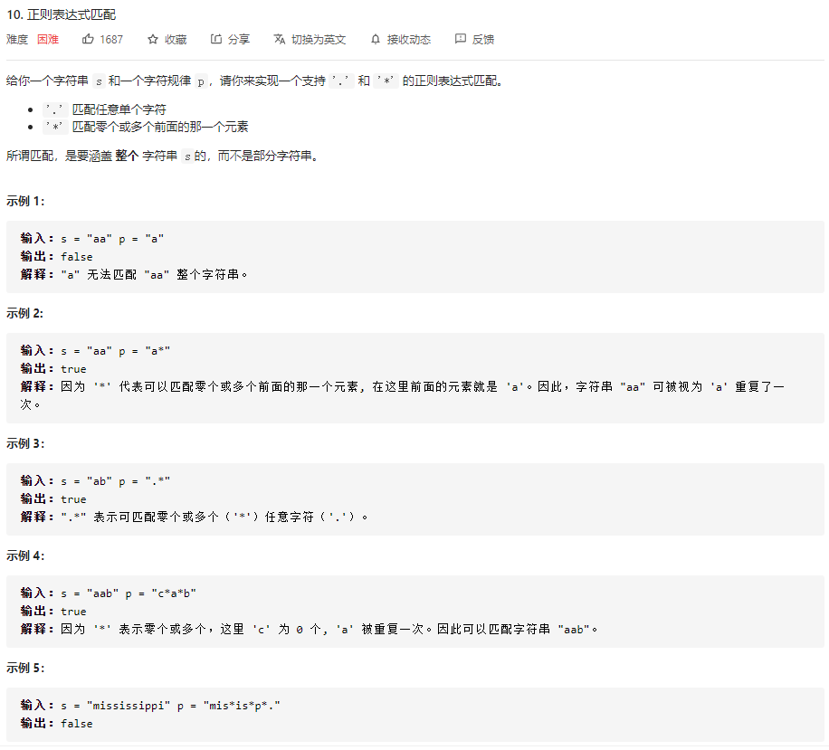
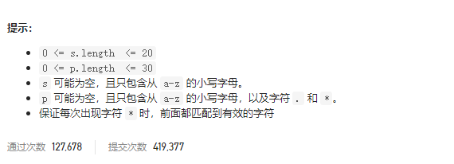
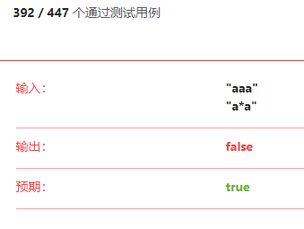

### leetcode_10_hard_正则表达式匹配





```c++
class Solution {
public:
    bool isMatch(string s, string p) {

    }
};

```

####  dp解法

对于模板p中的一个字符，只能在s中匹配一个字符，匹配方法有唯一性。对于模板p中的字符+*组合，能在s中匹配任意数量的字符，没有唯一性。因此，考虑使用**dp算法**，枚举匹配的方案。

构造dp数组dp[i] [j]。代表字符串p的前i个元素与模板q的前j个元素能否匹配(下标从1开始)。则递推公式如下

- 若p的第j个元素，即p[j-1]=='*'，则匹配任意数量个字符
  - 最简单的情况，模板是否可用于匹配0个字符。如果dp[i] [j-2]==true，则dp[i] [j]=true
  - 其次，当模板与末尾字符相同，即s[i-1]==p[j-2]的时候，则往前匹配一个字符。dp[i] [j]=dp[i-1] [j]。
  - 再次，当模板与末尾字符也无法匹配时，dp[i] [j]=false
- 若p的第j个元素，即p[j-1]!='*'，则匹配单个字符。比较字符串p与模板q的末尾元素是否相同。

##### 注意点:

- **首行**元素，即空字符串是否能与模板匹配，需另外构造状态转移方程。此处不赘述
- **首列**元素，即非空字符串是否能与空模板匹配。不能
- dp数组的**长，宽**，分别是**size(p)+1与size(q)+1**。因为需要讨论0~size(p)与0~size(q)个字符的匹配问题。
- 讨论"任意字符"的模板，不影响之后讨论"任意字符*"的模板匹配问题。

```c++
class Solution {
public:
	bool isMatch(string s, string p) {
		int i, j;
		int sizeS = size(s), sizeP = size(p);
		vector<vector<bool>>dp(sizeS+1, vector<bool>(sizeP+1, false));  //s的前i个字符 与p的前j个字符是否匹配 (当讨论第n个字符时，n下标从1开始)

		//首行 即空字符串与模板进行匹配
		dp[0] = vector<bool>(sizeP+1, false);
		dp[0][0] = true;
		dp[0][1] = false;
		for (j = 2; j <= sizeP; j++)
		{
			if (p[j - 1] == '*')
				dp[0][j] = dp[0][j - 2];
			else
				dp[0][j] = false;
		}
		//其它行
		for(i = 1; i <= sizeS; i++)
		{
			dp[i][0] = false;  //任意非空字符串 与空模板 总是不匹配的
			for(j = 1; j <= sizeP; j++)  //讨论s的前i个元素，与p的前j个元素是否匹配。下标均从1开始
			{
				if (p[j-1] == '*')
				{
					if (dp[i][j - 2])  //模板用于匹配0个字符
						dp[i][j] = true;
					else if (matches(s[i-1], p[j-2]))  //模板用于匹配至少1个字符
						dp[i][j] = dp[i - 1][j];
					else  //无法匹配
						dp[i][j] = false;
				}
				else
				{
					if (matches(s[i-1], p[j-1]))
						dp[i][j] = dp[i - 1][j - 1];
					else
						dp[i][j] = false;
				}
			}
		}
		return dp[sizeS][sizeP];
	}

	bool matches(char a, char b)
	{
		if (b == '.' || a == b)
			return true;
		else
			return false;
	}
};
```

#### 我的错误思路

使用模板q，与尽可能长的字符串p进行匹配。错误。

例如 测试用例



```c++
class Solution {
public:
	enum State
	{
		SPECIFIC_LETTER,  //需要一个特定字符
		ANY_LETTER,  //需要一个任意字符
		SPECIFIC_LETTERS,  //需要任意个特定字符
		ANY_LETTERS,  //需要任意个任意字符
		SUCCESS  //匹配成功结束
	};
	//从第index个单词开始，检测字符串是否与当前模态匹配
	bool match(string& s, State state,int& index,char letterNeed='_')
	{
		while (true)  //状态循环
		{
			switch (state)
			{
			case SPECIFIC_LETTER:
				if (index<s.size()&&s[index] == letterNeed)
				{
					index++;
					return true;
				}
				else
					return false;
			case ANY_LETTER:
				if (index < s.size())
				{
					index++;
					return true;
				}
				else
					return false;
			case ANY_LETTERS:
				index = s.size();
				return true;
			case SPECIFIC_LETTERS:
				if (index < s.size() && s[index] == letterNeed)
				{
					index++;  //仍然为SPECIFIC_LETTERS状态
					break;
				}					
				else
					return true;
			case SUCCESS:
				return true;
			default:
				break;
			}
		}
		return false;  //跑不到这行，为了保证总有返回值而添加该行

	}
	bool isMatch(string s, string p) {
		int i;  //当前s待处理的字符下标
		int j;  //当前p待处理的字符下标
		bool canMatch;
		char letterNeed;  //待匹配的字符
		State state;
		
		for (i = 0, j = 0; j < p.size();)
		{
			//根据模板进行匹配
			if (p[j] == '.')  //需要一个任意字符
			{
				if (j + 1 < p.size() && p[j + 1] == '*')  //需要任意个任意字符
				{
					canMatch = match(s, ANY_LETTERS, i);
					j += 2;
				}
				else  //需要一个任意字符
				{
					canMatch = match(s, ANY_LETTER, i);
					j++;
				}
			}
			else
			{
				if (j + 1 < p.size() && p[j + 1] == '*')  //需要任意个特定字符
				{
					canMatch = match(s, SPECIFIC_LETTERS, i, p[j]);
					j += 2;
				}
				else  //需要一个特定字符
				{
					canMatch = match(s, SPECIFIC_LETTER, i, p[j]);
					j++;
				}
			}
			//判断匹配是否成功
			if (!canMatch)
				return false;
		}
		if (i == s.size())
			return true;
		else
			return false;

		
	}
};
```

