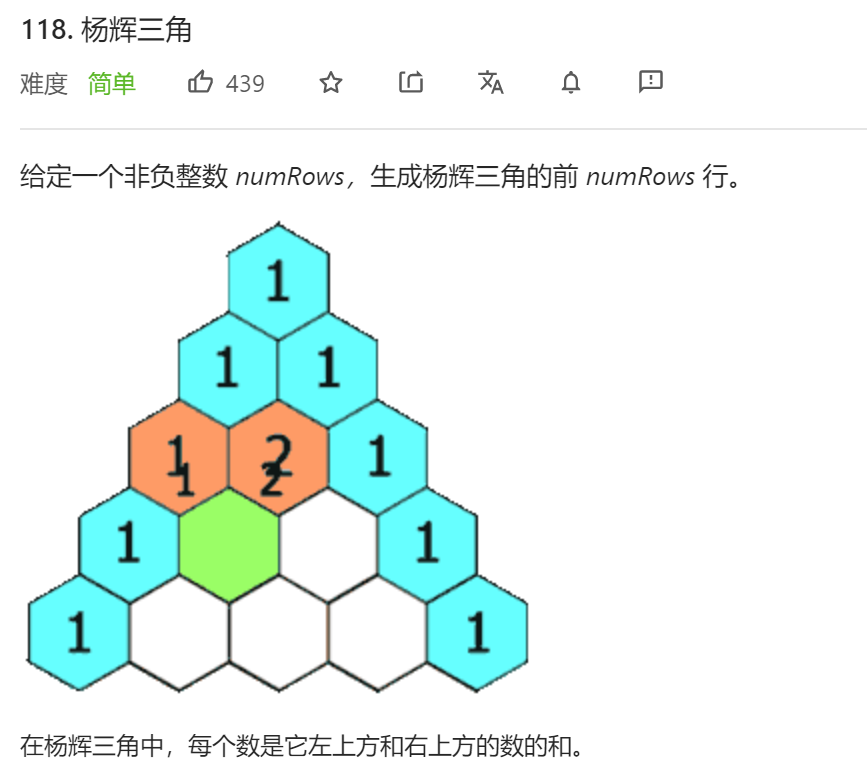
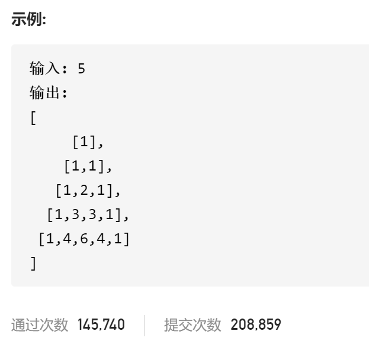

### leetcode_118_easy_杨辉三角





```c++
class Solution {
public:
    vector<vector<int>> generate(int numRows) {
        
    }
};
```

#### 算法思路

略

```c++
class Solution {
public:
	vector<vector<int>> generate(int numRows) {
		int y, x;
		vector<int> curLine;
		vector<vector<int>> result;

		if (numRows <= 0)
			return result;
		result.push_back({ 1 });
		for (y = 1; y < numRows; y++)
		{
			curLine.clear();
			curLine.push_back(1);
			for (x = 1; x < y; x++)
				curLine.push_back(result[y - 1][x - 1] + result[y - 1][x]);
			curLine.push_back(1);
			result.push_back(curLine);
		}
		return result;
	}
};
```

