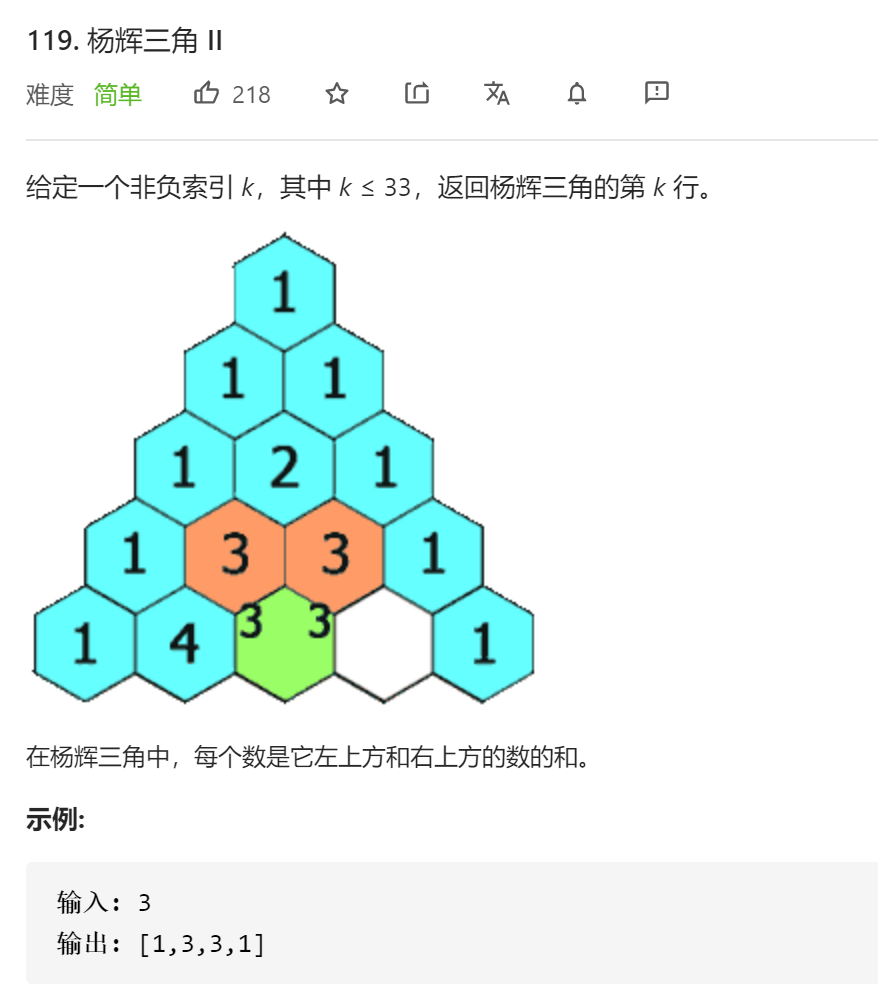
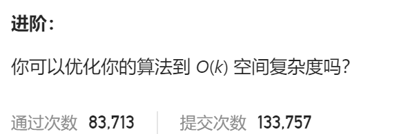

### leetcode_119_easy_杨辉三角Ⅱ





```c++
class Solution {
public:
    vector<int> getRow(int rowIndex) {

    }
};
```

#### 算法思路

略

```c++
class Solution {
public:
	vector<int> getRow(int rowIndex) {
		int y, x;
		vector<int> curLine, formerLine;

		curLine = { 1 };
		for (y = 1; y <= rowIndex; y++)
		{
			formerLine = curLine;
			curLine.clear();
			curLine.push_back(1);
			for (x = 1; x < y; x++)
				curLine.push_back(formerLine[x - 1] + formerLine[x]);
			curLine.push_back(1);
		}
		return curLine;
	}
};
```

