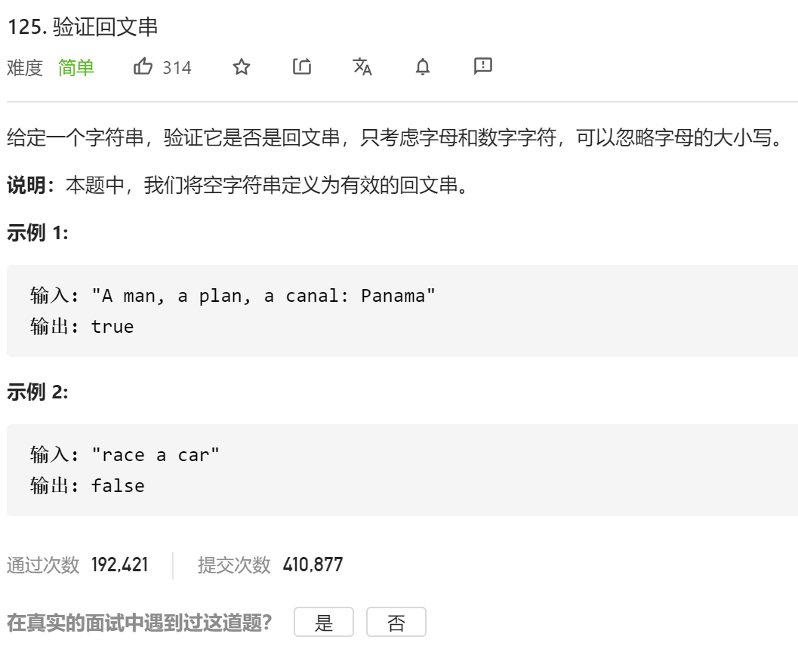

### leetcode_125_easy_验证回文串



```c++
class Solution {
public:
    bool isPalindrome(string s) {

    }
};
```

#### 算法思路

主要考察字符串相关api的使用。详见 字符串常用api.md

```c++
class Solution {
public:
	bool isPalindrome(string s) {
		int left, right;

		left = 0;
		right = s.size() - 1;
		while (left < right)
		{
			while (left < right && !isalnum(s[left]))
				left++;
			while (left < right && !isalnum(s[right]))
				right--;
			if (tolower(s[left]) != tolower(s[right]))
				return false;
            left++;
            right--;
		}
		return true;
	}
};
```

