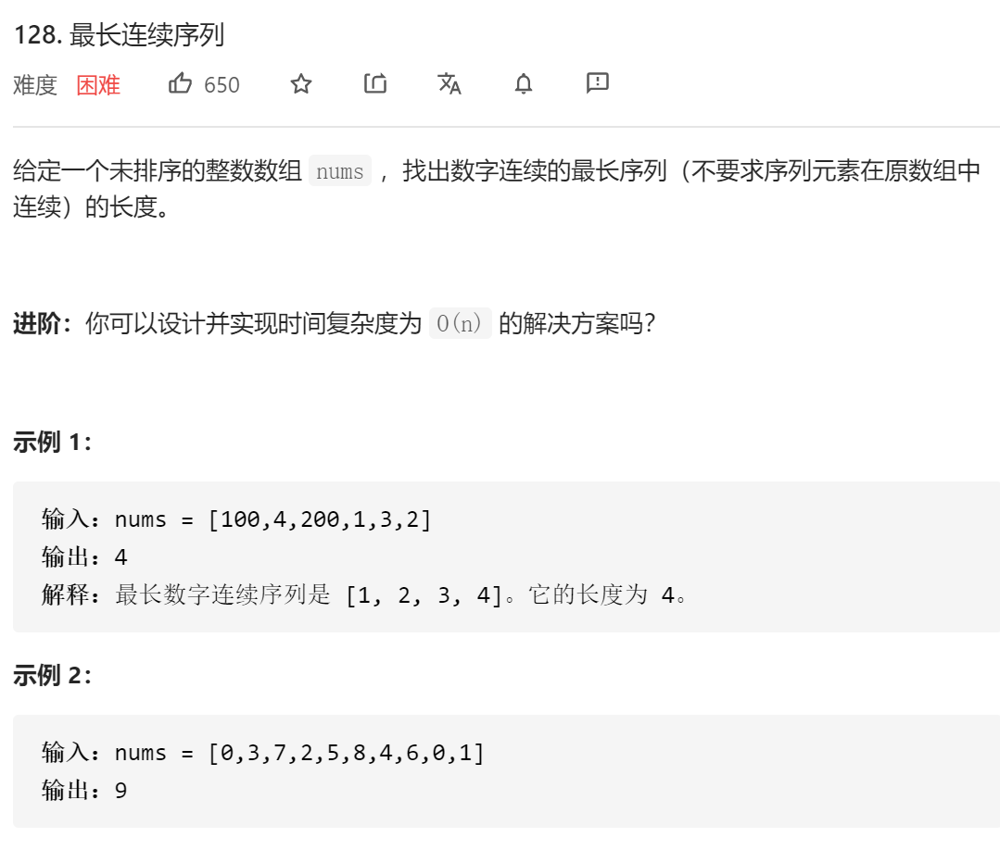
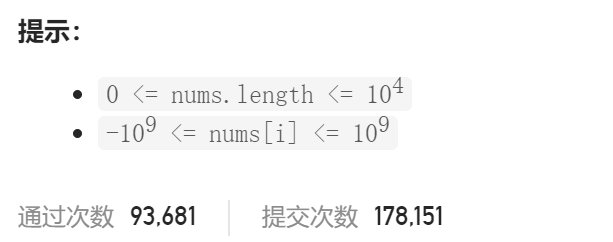

### leetcode_128_hard_最长连续序列





```c++
class Solution {
public:
    int longestConsecutive(vector<int>& nums) {

    }
};
```

#### 算法思路

进阶 要求实现时间复杂度O(n)的算法，这意味着，只能对数组中的每个元素扫描常数遍。

暴力算法：将数组中每个元素存储在set中。对于数组中的每个元素nums[i]=n，分别扫描n-1,n-2....   n+1,n+2... 是否在数组中，这样的时间复杂度上界是O(n^2)

对以上暴力算法进行改进。讨论nums[i]=n时，如果n+1,n+2等元素出现在了nums数组中，就将其标记为“已访问过”，下次讨论到这个元素时直接跳过