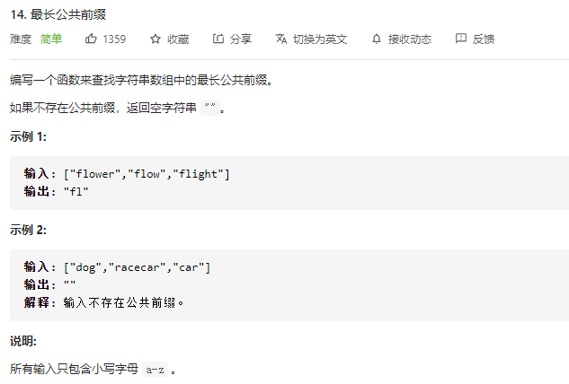

### leetcode_14_easy_最长公共前缀



```c++
class Solution {
public:
    string longestCommonPrefix(vector<string>& strs) {

    }
};
```

```c++
class Solution {
public:
	string longestCommonPrefix(vector<string>& strs) {
		int i,j;
		string result;

		if (strs.empty())
			return "";
		result = strs[0];
		for (i = 0; i < strs.size(); i++)
		{
			for (j = 0; j < result.size(); j++)
			{
				if (result[j] != strs[i][j])
					break;
			}
			result = result.substr(0, j);
			if (result.empty())
				return "";
		}
		return result;
	}
};
```

