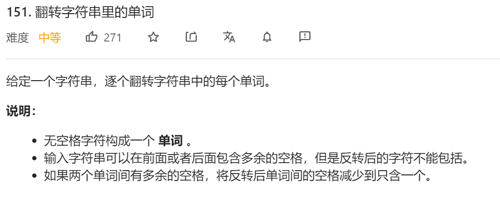
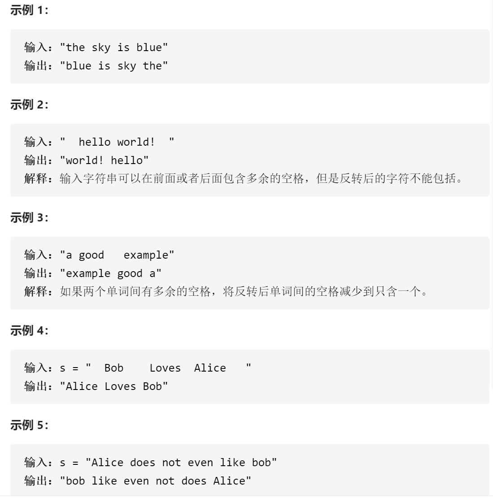
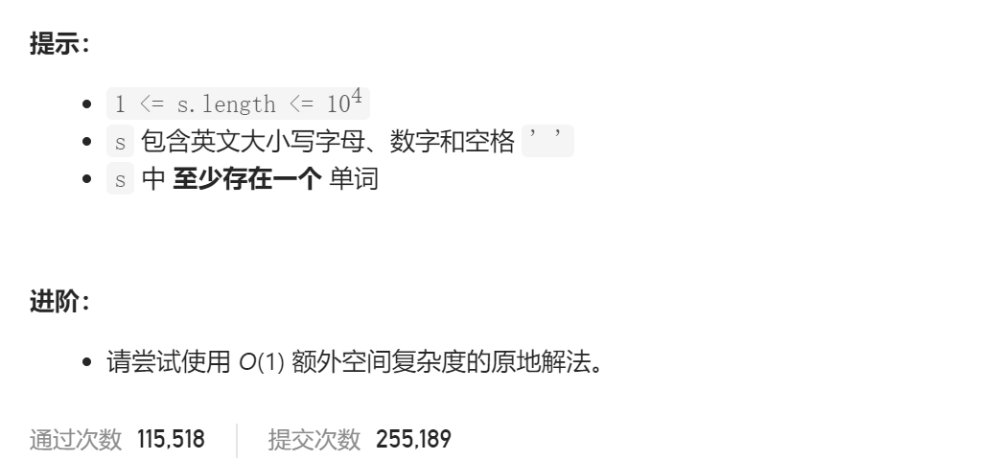

### leetcode_151_medium_翻转字符串里的单词







#### 算法思路

如果不限制O(1)空间复杂度，则分别扫描到每个单词，存储到vector中。反转vector即可。不赘述

在O(1)空间复杂度的限制下，算法的时间性能会有一定的牺牲。可以考虑，第一次 进行字符级别的翻转。例如 将例一 翻转为"eulb si yks eht"。第二次 移除多余的空格。第三次 对每个单词翻转回来

```c++
class Solution {
public:
	string reverseWords(string s) {
		string::iterator it, it1, it2;

		if (s.empty())
			return s;
		//第一趟 字符级翻转
		reverse(s.begin(), s.end());
		//第二趟 移除多余的空格
		for (it = s.begin(); ; ++it)
		{
			if (*it == ' ')  //遇到空格，则移除之后所有多余的空格
			{
				++it;
				while (it != s.end() && *it == ' ')
					it = s.erase(it);
			}
			if (it == s.end())
				break;
		}
		if (s[0] == ' ')
			s.erase(s.begin());
		if (s[s.size() - 1] == ' ')
			s.erase(s.end() - 1);
		//第三趟 将每个单词翻转回来
		for (it1 = s.begin(),it2=s.begin(); ; it1 = it2 + 1)
		{
			it2 = it1 + 1;
			while (it2 != s.end() && *it2 != ' ')  //找到当前单词的末尾
			{
				it2++;
			}
			reverse(it1, it2);
			if (it2 == s.end())  //当it2指向末尾的时候，已经没有下个单词待处理了
				break;
		}

		return s;
	}
};
```

