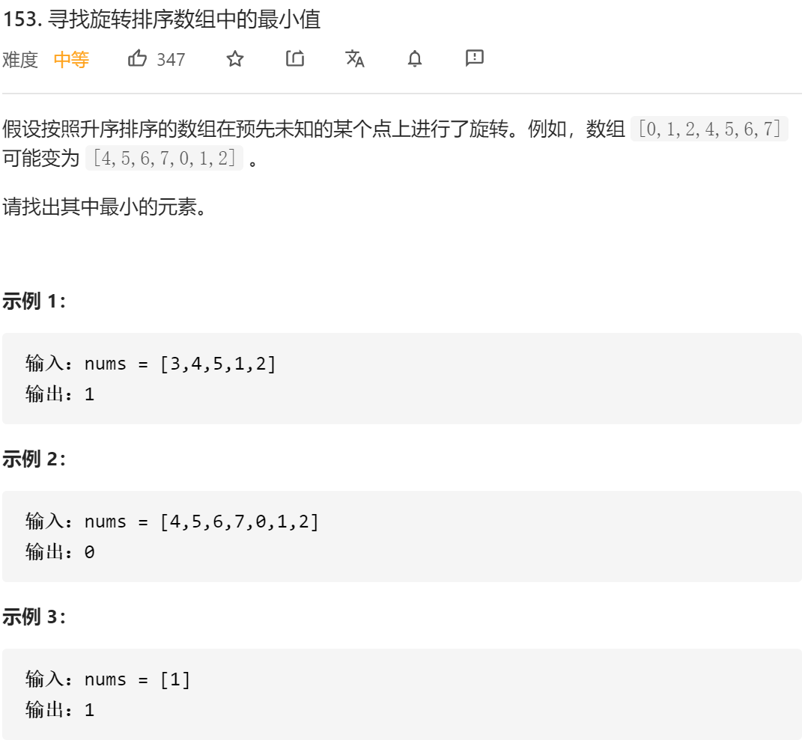
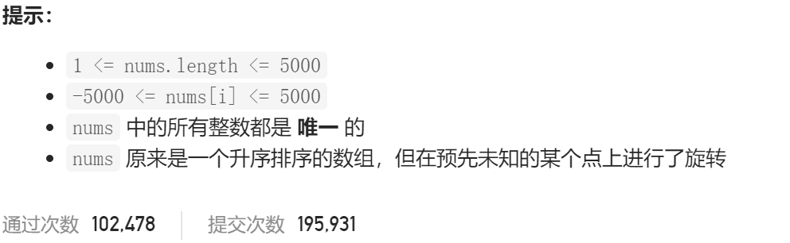

### leetcode_153_medidum_寻找旋转排序数组中的最小值





```c++
class Solution {
public:
    int findMin(vector<int>& nums) {

    }
};
```

#### 寻找旋转点

找旋转点，旋转点i满足nums[i]>nums[i+1]。则旋转点之后的那个数字 即为最小值。

使用二分查找法。旋转点所在的那个区间，满足nums[l]>nums[r]。

注意 有两个特殊情况，导致旋转点不存在

- nums.size()==1，意味着数组旋转了也不会发生变化
- nums[0]<nums[nums.size()-1]，意味着数组没有发生旋转

```c++
class Solution {
public:
	int findMin(vector<int>& nums) {
		int l, r, mid;
		
		if (nums.size() == 1)  //不存在旋转点
			return nums[0];
		if (nums[0] < nums[nums.size() - 1])  //不存在旋转点
			return nums[0];
		l = 0;
		r = nums.size() - 1;
		while (r-l>1)
		{
			mid = (l + r) / 2;
			if (nums[l] > nums[mid])
				r = mid;
			else
				l = mid;
		}
		return nums[(l + 1) % nums.size()];
	}
};
```

#### 直接找最小值

参考https://leetcode-cn.com/problems/find-minimum-in-rotated-sorted-array/solution/er-fen-cha-zhao-wei-shi-yao-zuo-you-bu-dui-cheng-z/

仍然是使用二分查找法。循环条件是left<right。由于取mid=(left+right)/2，该除法向下取整，所以总有mid<right。**方便起见，仅讨论[mid,right]这个区间**。

- 因为mid严格小于right，所以不存在nums[mid]==nums[right]的情况
- 如果nums[mid]<nums[right]，则[mid,right]为有序区间。则[mid+1,right]区间内的值都不可能为最小值。令right=mid
- 如果nums[mid]>nums[right]，则最小值点一定出现在右侧区间内。而nums[mid]大于nums[right]，不可能为最小值点。所以 令left=mid+1

```c++
class Solution {
public:
	int findMin(vector<int>& nums) {
		int left, right, mid;

		left = 0;
		right = nums.size() - 1;
		while (left < right)
		{
			mid = (left + right) / 2;
			if (nums[mid] < nums[right])
				right = mid;
			else  //nums[mid]>nums[right]的情况
				left = mid + 1;
		}
		return nums[left];  //循环结束，left=right
	}
};
```

**另外，对于mid=(left+right+1)/2，这样的向上取整的情况，方便起见，也就对应地讨论[left,mid]区间，寻找最大值**。代码不赘述