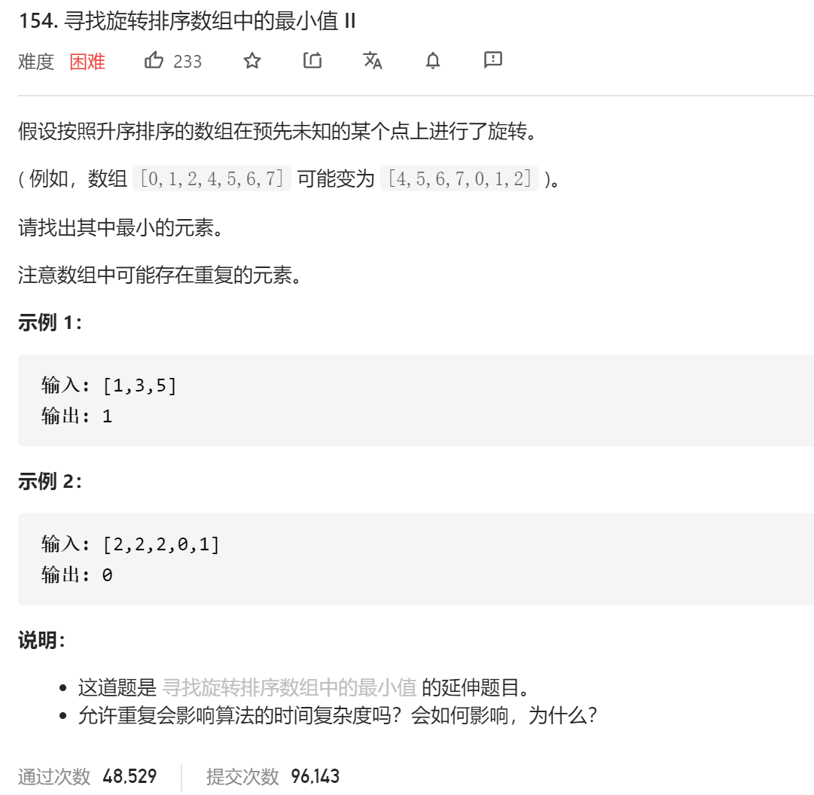

### leetcode_154_hard_寻找旋转排序数组中的最小值 Ⅱ



```c++
class Solution {
public:
    int findMin(vector<int>& nums) {

    }
};
```

#### 算法思路

类似leetcode_153_medium_寻找旋转排序数组中的最小值 方法2，求最小值点

仍然使用二分查找法，循环条件是left<right。由于取mid=(left+right)/2，该除法向下取整，所以总有mid<right。**方便起见，仅讨论[mid,right]这个区间**。

- 如果nums[mid]==nums[right]，不妨令right--，不再讨论这个重复元素
- 如果nums[mid]<nums[right]，则[mid,right]为有序区间。则[mid+1,right]区间内的值都不可能为最小值。令right=mid
- 如果nums[mid]>nums[right]，则最小值点一定出现在右侧区间内。而nums[mid]大于nums[right]，不可能为最小值点。所以 令left=mid+1

```c++
class Solution {
public:
	int findMin(vector<int>& nums) {
		int left, right, mid;

		left = 0;
		right = nums.size() - 1;
		while (left < right)
		{
			mid = (left + right) / 2;
			if (nums[mid] == nums[right])
				right--;
			else if (nums[mid] < nums[right])
				right = mid;
			else
				left = mid + 1;
		}
		return nums[left];
	}
};
```

