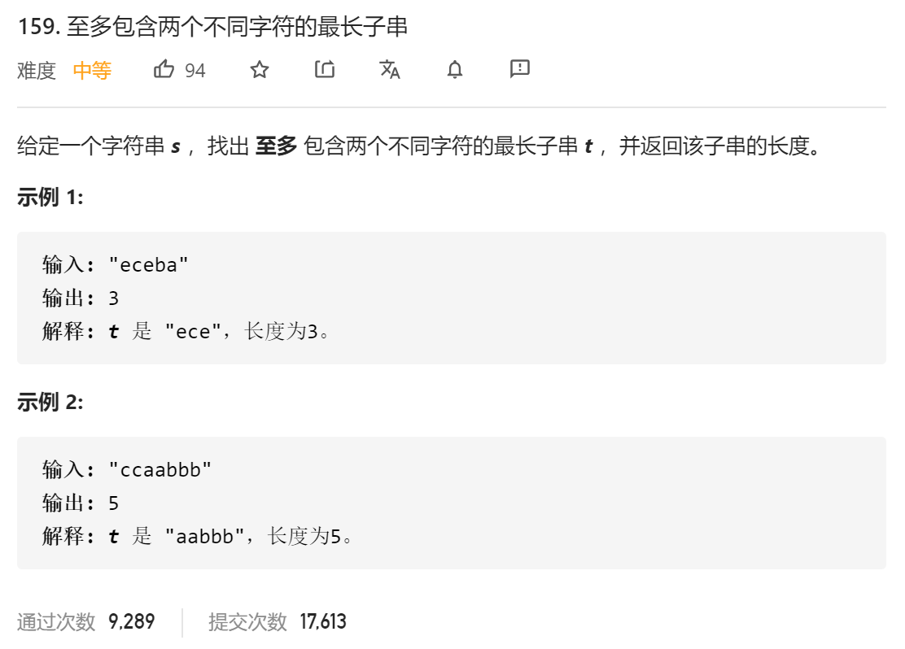

### leetcode_159_medium_至多包含两个不同字符的最长子串



```c++
class Solution {
public:
    int lengthOfLongestSubstringTwoDistinct(string s) {

    }
};
```

#### 算法思路

分别讨论以每一个s[i]作为子串末尾的 子串的长度。滑动窗口法

```c++
class Solution {
public:
	int lengthOfLongestSubstringTwoDistinct(string s) {
		char c1='*', c2='*';  //组成字符串的两个字符。 '*'代表尚未分配
		int l, r, result = 0;
		vector<int> recentPos(128, -1);  //字符最近一次出现的位置

		l = 0;
		for (r = 0; r < s.size(); r++)
		{
			recentPos[s[r]] = r;
			if (c1 == s[r] || c2 == s[r])
				;
			else if (c1 == '*')  //如果字符串中的字符种类不足2，则添加字符s[r]
				c1 = s[r];
			else if (c2 == '*')  //如果字符串中的字符种类不足2，则添加字符s[r]
				c2 = s[r];
			else if (recentPos[c1] < recentPos[c2])  //替换掉最近最少出现的字符
			{
				l = recentPos[c1] + 1;
				c1 = s[r];
			}
			else  //替换掉最近最少出现的字符
			{
				l = recentPos[c2] + 1;
				c2 = s[r];
			}

			result = max(result, r - l + 1);
		}
		return result;
	}
};
```

