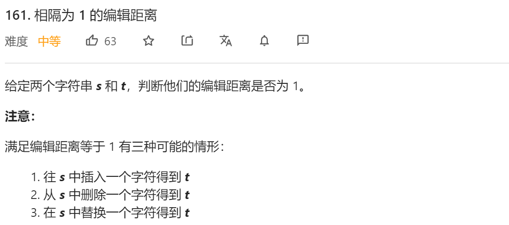
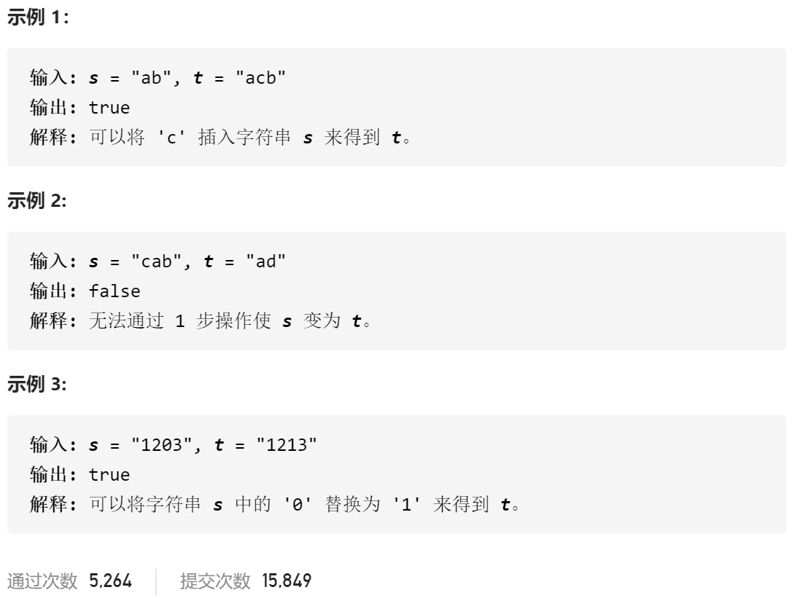

### leetcode_161_medium_相隔为1的编辑距离





```c++
class Solution {
public:
    bool isOneEditDistance(string s, string t) {

    }
};
```

#### 算法思路

分别讨论两种情况

- s、t长度相等的情况下，能否通过修改一个字符实现变换
- s、t长度相差为1的情况下，能否通过增添一个字符来实现变换

```c++
class Solution {
public:
	bool isOneEditDistance(string s, string t) {
		int i,j,k,distance;

		//字符等长，则修改一个字符
		distance = 0;
		if (s.size() == t.size())
		{
			for (i = 0; i < s.size(); i++)
				distance += s[i] == t[i] ? 0 : 1;
			return distance == 1;
		}
		//编辑距离必大于1
		if(abs(int(s.size())-int(t.size()))>1)
			return false;
		//字符长度差1，尝试只添加一个字符
		if (s.size() > t.size())  //统一使得s比t短1个字符
			swap(s, t);
		for (i = 0, j = 0; i < s.size() && j < t.size(); i++, j++)
		{
			if (s[i] != t[j])  
				i--;  //相当于为s添加一个字符 用于匹配t[j]
		}
		if (i == s.size() && j == t.size())  //刚好添加了一个字符 匹配成功
			return true;
		else if (i == s.size() && j == t.size() - 1)  //前s.size()个字符都完全一致 匹配成功
			return true;
		else
			return false;
	}
};

```

