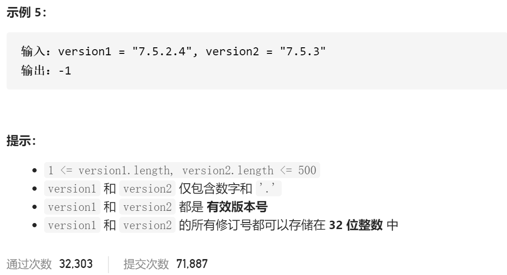

### leetcode_165_medium_比较版本号




```c++
class Solution {
public:
    int compareVersion(string version1, string version2) {

    }
};
```

#### 算法思路

先将版本号字符串转为vector<int>，再进行比较

```c++
class Solution {
public:
	int compareVersion(string version1, string version2) {
		int i,j;
		vector<int> v1, v2;

		v1 = parseVersion(version1);
		v2 = parseVersion(version2);
		for (i = 0,j=0; i < v1.size()&&j<v2.size(); i++,j++)
		{
			if (v1[i] > v2[i])
				return 1;
			if (v1[i] < v2[i])
				return -1;
		}

		if (v1.size() != v2.size())
			return v1.size() > v2.size() ? 1 : -1;
		else
			return 0;
	}

	//将版本号解析为字符串
	vector<int> parseVersion(string version)
	{
		int l,r;
		vector<int> result;

		//解析版本号
		l = 0;
		r = 0;
		version += '.';  //以'.'作为修订号结束的标志
		while (r < version.size())
		{
			if (version[r] == '.')
			{
				result.push_back(stoi(version.substr(l, r - l)));
				l = ++r;
			}
			else
				++r;
		}
		//移除多余的0
		while (!result.empty() && result.back() == 0)
			result.pop_back();
		return result;
	}
};
```

