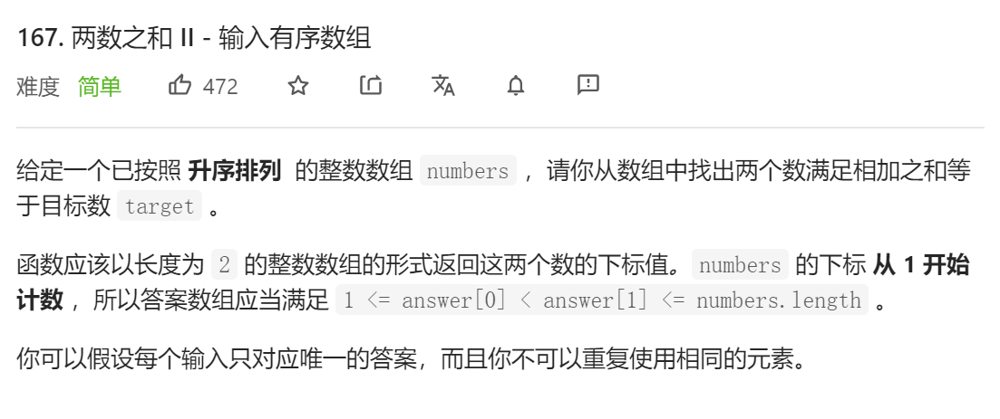
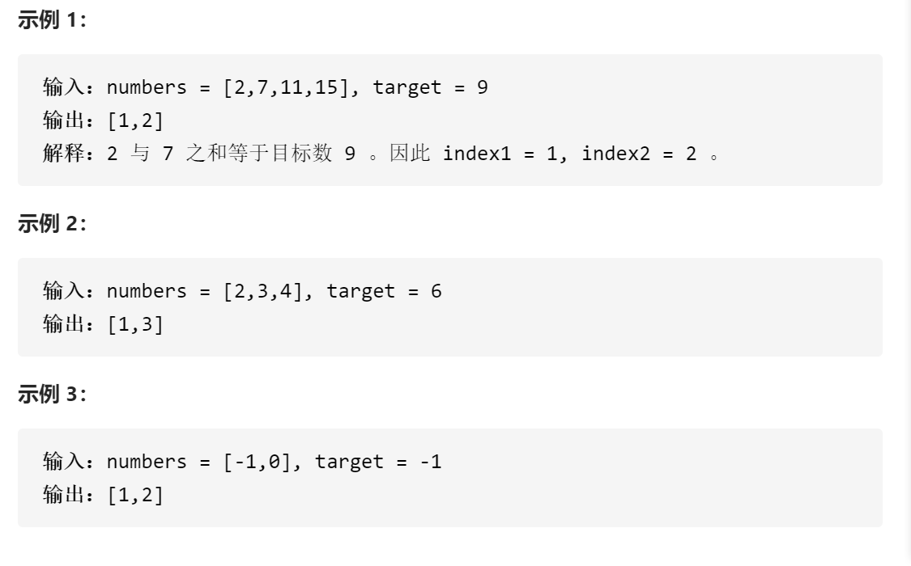
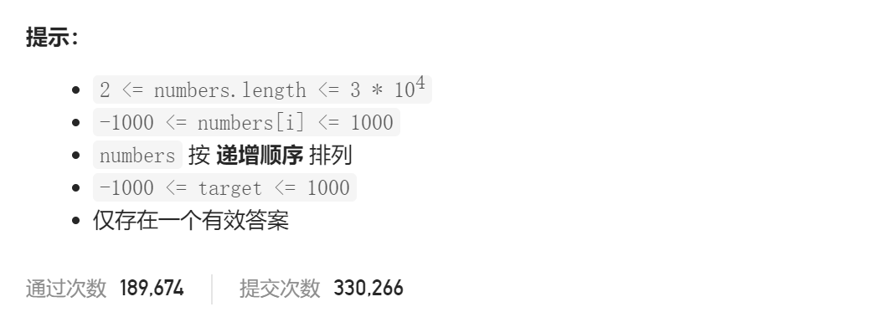

### leetcode_167_easy_两数之和Ⅱ - 输入有序数组







```c++
class Solution {
public:
    vector<int> twoSum(vector<int>& numbers, int target) {

    }
};
```

#### 算法思路

双指针，具体做法见代码。

算法的正确性证明，可用数学归纳法。简述如下：当nums[l]+nums[r]<target 时，对于l<k<=r的任意元素nums[k]，均无法满足nums[l]+nums[k]==target。所以 nums[l]不可能构成一个解。l++

```c++
class Solution {
public:
	vector<int> twoSum(vector<int>& numbers, int target) {
		int l = 0, r = numbers.size() - 1, sum;

		while (l < r)
		{
			sum = numbers[l] + numbers[r];
			if (sum == target)
				return { l + 1,r + 1 };
			else if (sum < target)
				l++;
			else
				r--;
		}
		return { -1,-1 };
	}
};
```

