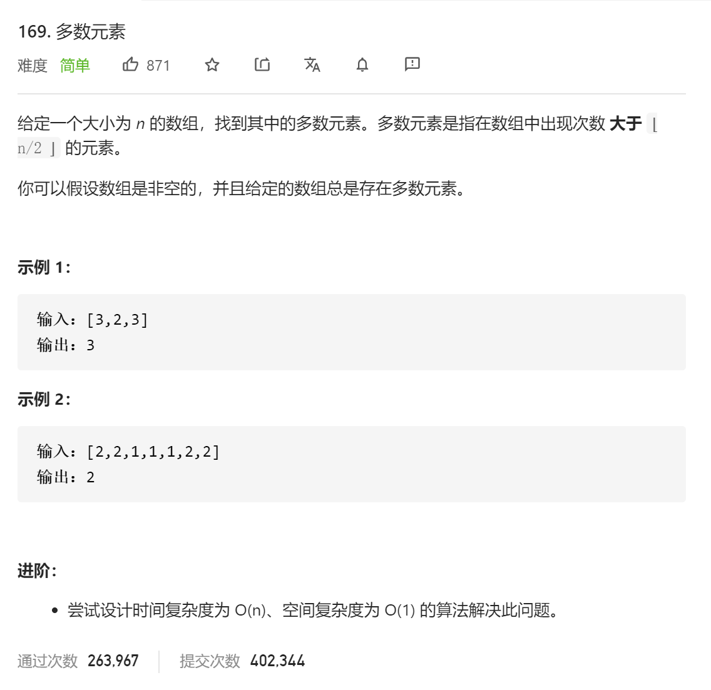

### leetcode_169_easy_多数元素



```c++
class Solution {
public:
    int majorityElement(vector<int>& nums) {

    }
};
```

#### 算法思路

换一种理解方法。认为数组中的元素，和与之不同的元素两两抵消，那么最终剩下的总会是多数元素

```c++
class Solution {
public:
	int majorityElement(vector<int>& nums) {
		int i,n=nums[0], existNum = 1;

		for (i = 1; i < nums.size(); i++)
		{
			if (existNum == 0)
			{
				n = nums[i];
				existNum = 1;
			}
			else
				existNum += n == nums[i] ? 1 : -1;
		}
		return n;
	}
};
```

