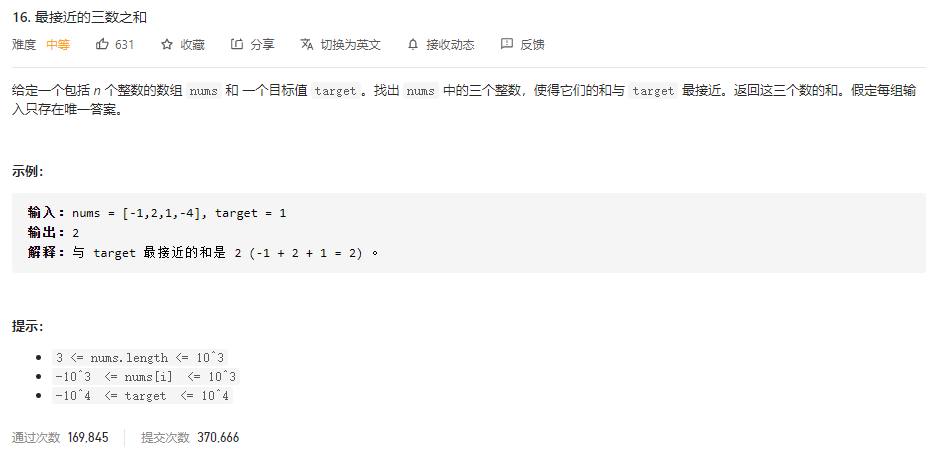
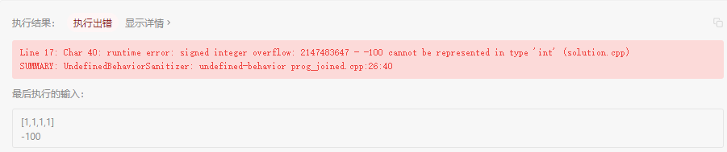
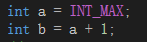
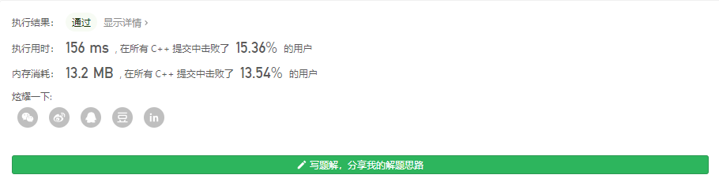

### leetcode_16_medium_最接近的三数之和



```c++
class Solution {
public:
    int threeSumClosest(vector<int>& nums, int target) {

    }
};
```

#### 算法思路

类似leetcode_15_medium_三数之和。先排序数组，然后使用3个数组下标。外层循环控制第一个数组下标，内层循环控制剩余双指针接近target。

##### 双指针

双指针算法的操作不再赘述。仅讨论其正确性。

对于已经讨论过的一个三元组下标(a,b,c)，如果nums[a]+nums[b]+nums[c]<target，如何移动b、c，来寻找下一个三元组？

如果保持b不动，那么，无论如何左移c得到c'，都有nums[a]+nums[b]+nums[c']<nums[a]+nums[b]+nums[c]<target，所以总无法得到更好的结果。因此，可以抛弃当前的b，即b++。

##### int越界问题



如上图所示，leetcode使用的c++编译器，会检测数据计算的越界，即不允许INT_MAX+1这类的操作。




然而，vs的c++编译器允许这类操作，只是会导致错误的结果。

因此，**使用INT_MAX等数据时，需注意避免计算越界**

```c++
class Solution {
public:
	int threeSumClosest(vector<int>& nums, int target) {
		int a, b, c;
		int sum, result = INT_MAX / 2;

		sort(nums.begin(), nums.end());
		a = 0;
		while (a < nums.size() - 2)
		{
			b = a + 1;
			c = nums.size() - 1;
			while (b < c)
			{
				sum = nums[a] + nums[b] + nums[c];
				//更新最接近的三数之和
				if (abs(sum - target) < abs(result - target))
					result = sum;
				//更新指针
				if (sum == target)
					return target;
				else if (sum < target)
					b++;
				else
					c--;
				//避免重复讨论
				while (b<c&&b>a + 1 && nums[b] == nums[b - 1])
					b++;
				while (b < c&&c < nums.size() - 1 && nums[c] == nums[c + 1])
					c--;
			}
			a++;
			while (a < nums.size() - 2 && nums[a] == nums[a - 1])
				a++;
		}
		return result;
	}
};
```

#### 算法思路

与 leetcode_15_medium_三数之和 类似。前两个指针对应外面两层循环。后两个指针，使用双指针的算法，对应内层循环

##### 指针收缩的去重

不同于leetcode15，本题中，每次指针收缩时都进行了去重判断。由于去重操作是在指针收缩操作之后的，因此，可以省略一个数组下标越界的判断。也就是说，当判断前一个数组下标对应的元素 与当前数组下标对应的元素是否一致时，无需检测前一个数组下标是合法的。

##### 避免重复计算size()

预先计算int nSize = nums.size(); 减少size()函数的调用。可以略微降低时间复杂度



