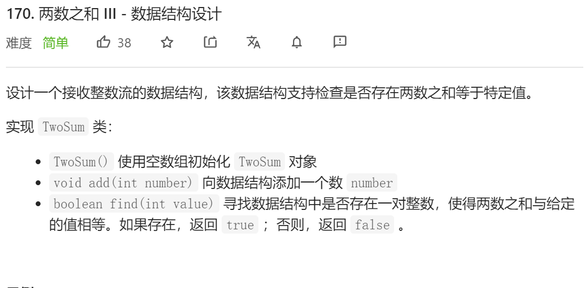
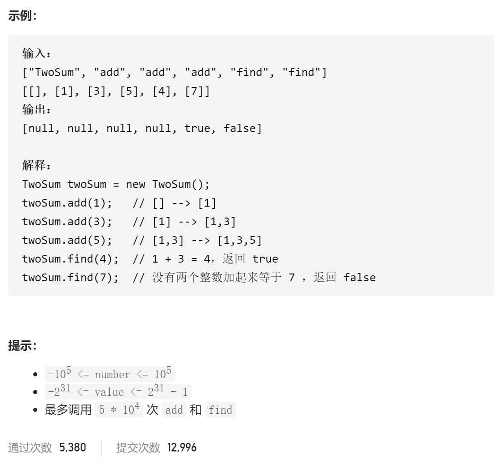

### leetcode_170_两数之和Ⅲ - 数据结构设计





#### 双指针法

类似 leetcode_167_easy_两数之和Ⅱ - 输入有序数组 的思路，查找操作 用双指针寻找是否有两数之和满足相加为target。

不过，该方法要求 在查找时数组是有序的。因此，将排序操作 放在每次查找之前

```c++
class TwoSum {
public:
	/** Initialize your data structure here. */
	TwoSum() {
		m_data = vector<int>{};
		m_bInorder = true;
	}

	/** Add the number to an internal data structure.. */
	void add(int number) {
		m_data.push_back(number);
		m_bInorder = false;
	}

	/** Find if there exists any pair of numbers which sum is equal to the value. */
	bool find(int value) {
		int l=0, r=m_data.size()-1,sum;
	
		if (!m_bInorder)
			sort(m_data.begin(), m_data.end());
		while (l < r)
		{
			sum = m_data[l] + m_data[r];
			if (sum == value)
				return true;
			else if (sum < value)
				l++;
			else
				r--;
		}
		return false;
	}

private:
	vector<int> m_data;
	bool m_bInorder;  //数组当前是否有序
};
```


#### 哈希表法

类似 leetcode_1_easy_两数之和 。用hashmap实现查找操作。代码略