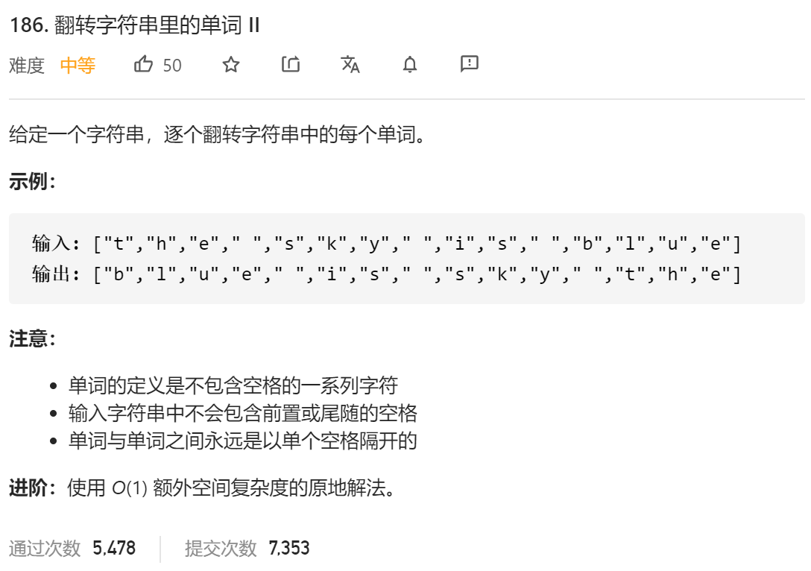

### leetcode_186_medium_翻转字符串里的单词 Ⅱ



```c++
class Solution {
public:
    void reverseWords(vector<char>& s) {
        
    }
};
```

#### 算法思路

leetcode_151_medium_翻转字符串里的单词 的简化版。

第一趟 字符级别翻转

第二趟 翻转每个单词

```c++
class Solution {
public:
	void reverseWords(vector<char>& s) {
		vector<char>::iterator it1 = s.begin(), it2 = s.begin();
		
        reverse(s.begin(),s.end());
		while (it2 != s.end())
		{
			while (it2 != s.end() && *it2 != ' ')
				it2++;
			reverse(it1, it2);
			if (it2 != s.end())
				it1 = ++it2;
		}
	}
};
```

