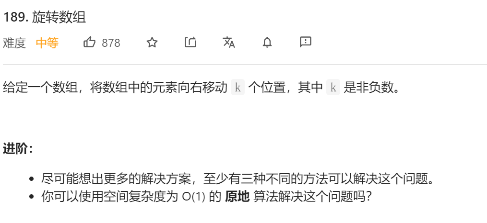
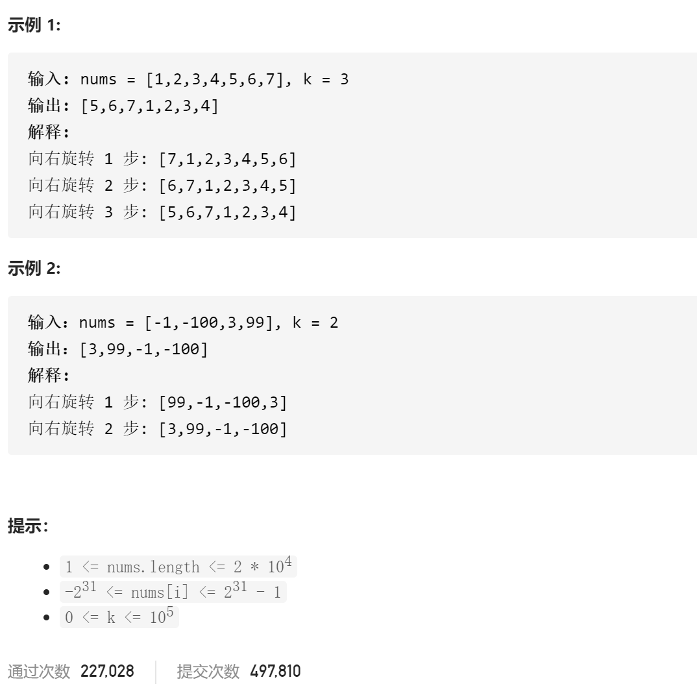

### leetcode_189_medium_旋转数组





```c++
class Solution {
public:
    void rotate(vector<int>& nums, int k) {
        
    }
};
```

#### 使用额外的数组

另外做一份数组的拷贝。nums去该数组中采样

```c++
class Solution {
public:
	void rotate(vector<int>& nums, int k) {
		int i,size=nums.size();
		vector<int> copy(nums);

		k = size - k%size;
		for (i = 0; i < size; i++)
			nums[i] = copy[(i + k) % size];
	}
};
```

#### 数组翻转

1. 翻转整个数组
2. 分别翻转左边一半及右边一半

这样得到的数组，在两个子段都分别有序，且两个子数组的位置发生了改变

```c++
class Solution {
public:
	void rotate(vector<int>& nums, int k) {
		k = k % nums.size();
		//第一次 翻转整个数组
		reverse(nums.begin(), nums.end());
		//第二次 分别翻转两个子数组
		reverse(nums.begin(), nums.begin() + k);
		reverse(nums.begin() + k, nums.end());
	}
};
```

