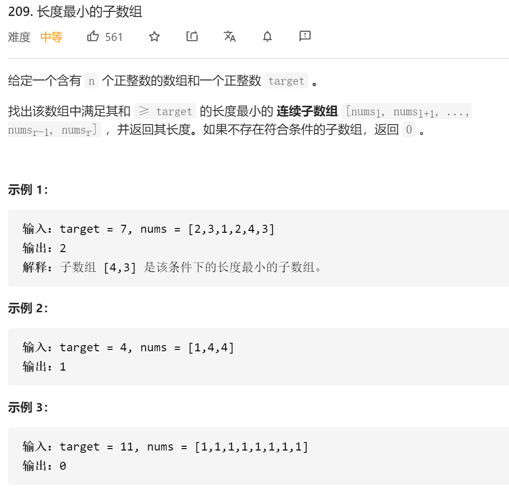
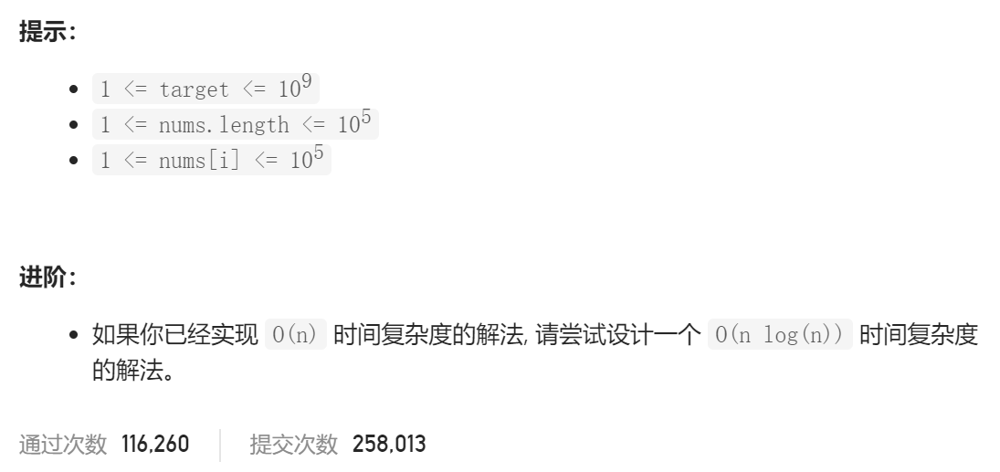
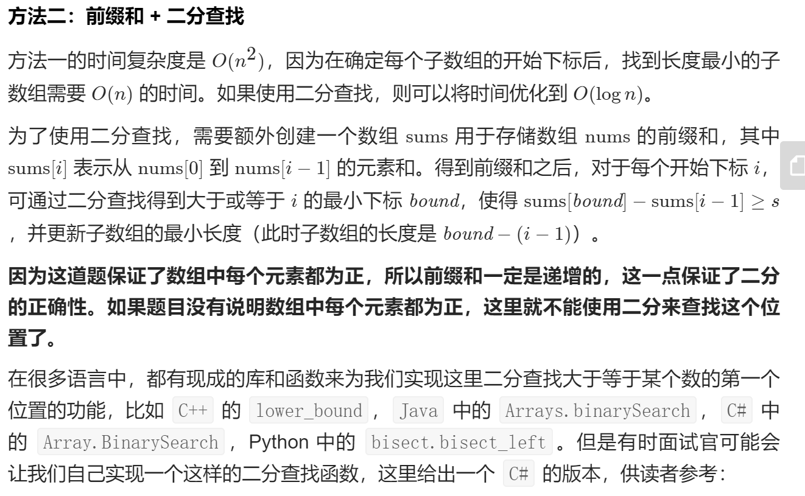

### leetcode_209_medium_长度最小的子数组





```c++
class Solution {
public:
    int minSubArrayLen(int target, vector<int>& nums) {

    }
};
```

#### 滑动窗口法

```c++
class Solution {
public:
	int minSubArrayLen(int target, vector<int>& nums) {
		int l, r, sum, result = INT_MAX;  //[l,r]区间为当前子串

		for (l = 0, r = 0, sum = 0; r < nums.size(); r++)
		{
			sum += nums[r];
			while (l <= r && sum >= target)
			{
				result = min(result, r - l + 1);
				sum -= nums[l++];
			}
		}
		return result == INT_MAX ? 0 : result;
	}
};
```

#### 前缀和+二分查找

详见leetcode官方题解

