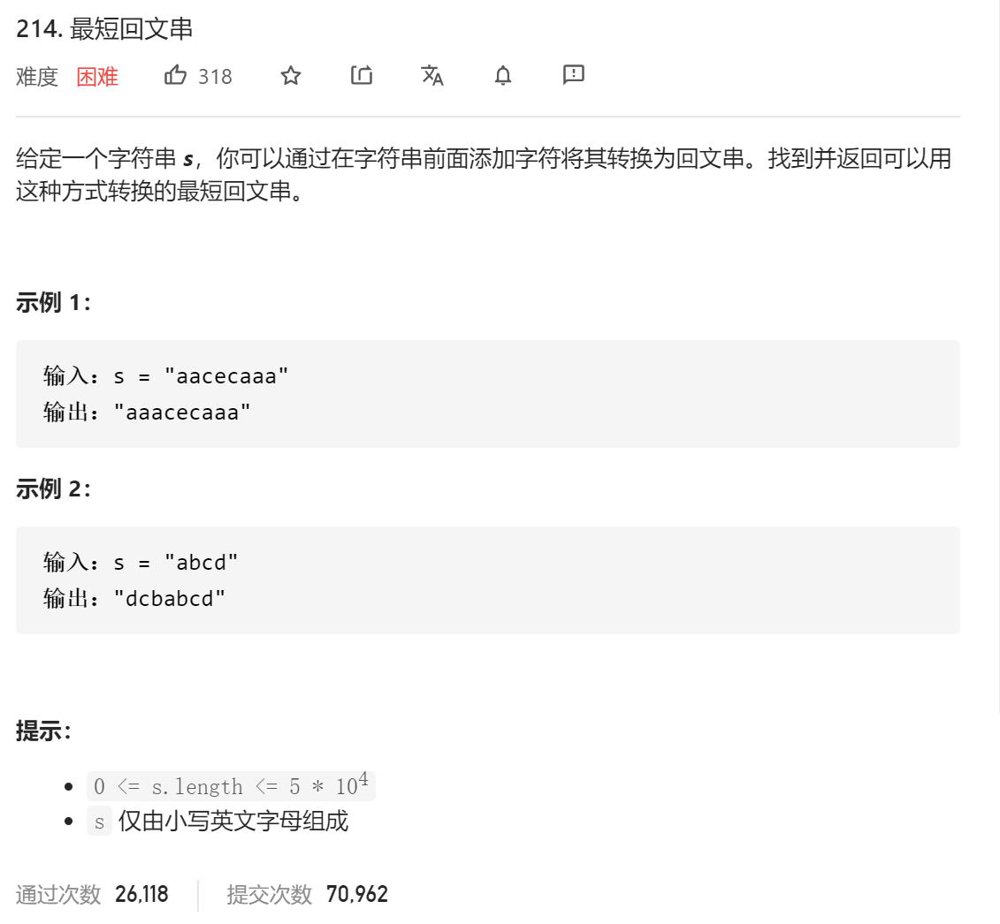

### leetcode_214_hard_最短回文串



```c++
class Solution {
public:
    string shortestPalindrome(string s) {

    }
};
```

#### 算法思路

问题转化为，寻找s的 从头开始的 尽可能长的子串s1，且满足s1为回文串。

容易想到，暴力枚举s1的结束位置，并判断其是否是一个回文串。不过时间复杂度O(n^2)，无法通过。

```
     432123456789
987654321234
```

https://blog.csdn.net/dark_cy/article/details/88698736

这个博客或许有用