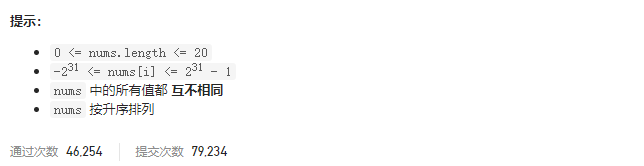

### leetcode_228_easy_汇总区间




```c++
class Solution {
public:
    vector<string> summaryRanges(vector<int>& nums) {

    }
};
```

#### 算法思路

```c++
class Solution {
public:
    vector<string> summaryRanges(vector<int>& nums) {
        int l,r;
        vector<string> result;

        l=0;
        while(l<nums.size())
        {
            //寻找区间[l,r)满足区间内的元素连续
            r=l+1;
            while(r<nums.size()&&nums[r]==nums[r-1]+1)  //[l,r)区间的元素连续
                ++r;
            //记录当前区间
            if(r-l==1)
                result.push_back(to_string(nums[l]));
            else
                result.push_back(to_string(nums[l])+"->"+to_string(nums[r-1]));
            //更新指针
            l=r;
        }
        return result;
    }
};
```

