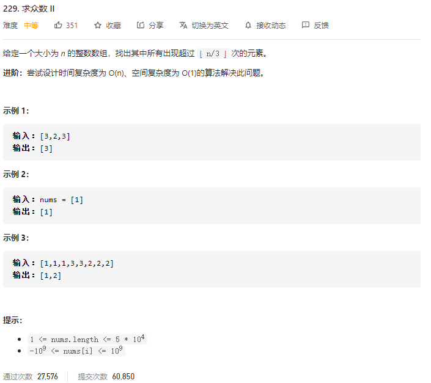

### leetcode_229_medium_求众数 Ⅱ



```c++
class Solution {
public:
    vector<int> majorityElement(vector<int>& nums) {

    }
};
```

#### 算法思路

要求出现次数严格大于 `⌊ n/3 ⌋`，易证，最多只有2个众数满足要求。

摩尔投票算法，可以解决这类问题，即：求得投票中得票数量前n的元素。

对于本题，不妨将得票数量前2名的元素记为cand1,cand2

1. 顺序扫描所有数组元素
   - 如果该元素是cand1或cand2，则累加
   - 如果该元素不是cand1或cand2
     - 如果cand1或cand2的计数器为0，则替换该候选者
     - 否则，减少cand1,cand2的计数器
2. 对于已经找到的出现次数前2名的元素，判断他们出现次数是否真的大于1/3

```c++
class Solution {
public:
	vector<int> majorityElement(vector<int>& nums) {
		int curNum, cand1, cand2, count1, count2;
		vector<int> result;

		if (nums.empty())
			return result;
		//找出出现次数前2名的元素
		cand1 = nums[0];
		cand2 = nums[0];
		count1 = 0;
		count2 = 0;
		for (int curNum : nums)
		{
			if (curNum == cand1)
				++count1;
			else if (curNum == cand2)
				++count2;
			else if (count1 == 0)
			{
				cand1 = curNum;
				count1 = 1;
			}
			else if (count2 == 0)
			{
				cand2 = curNum;
				count2 = 1;
			}
			else
			{
				--count1;
				--count2;
			}
		}
		//判断前2名元素 出现次数是否大于三分之一
		count1 = 0;
		count2 = 0;
		for (int curNum : nums)
		{
			if (curNum == cand1)
				++count1;
			else if (curNum == cand2)
				++count2;
		}
		if (count1 > nums.size() / 3)
			result.push_back(cand1);
		if (count2 > nums.size() / 3)
			result.push_back(cand2);
		return result;
	}
};
```

