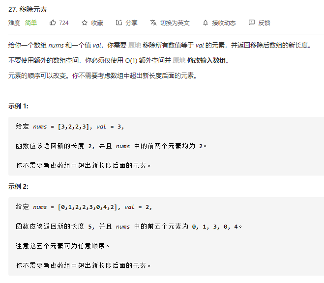
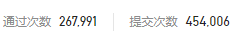

### leetcode_27_easy_移除元素





```c++
class Solution {
public:
    int removeElement(vector<int>& nums, int val) {

    }
};
```

#### 算法思路

与leetcode_26_easy_删除排序数组中的重复项 类似。两个指针，一个指向最后一个符合要求的位置，另一个指向当前迭代到的位置。

```c++
class Solution {
public:
	int removeElement(vector<int>& nums, int val) {
		int i;  //指向最近一个满足要求的数
		int j;  //指向迭代中的数
		for (i = -1, j = 0; j < nums.size(); j++)
		{
			if (nums[j] != val)
				nums[++i] = nums[j];
		}
		return i + 1;
	}
};
```

