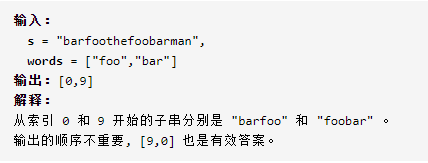
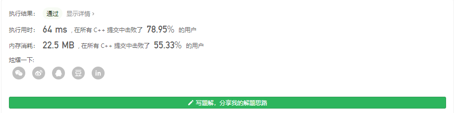

### leetcode_30_hard_串联所有单词的子串


```c++
class Solution {
public:
    vector<int> findSubstring(string s, vector<string>& words) {

    }
};
```

注意，**使用static变量，或者全局变量，可能与leetcode变量冲突**，导致提交错误。参考https://blog.csdn.net/viadimir/article/details/90416993

#### 暴力算法

朴素的思想，比较每一个子串是否与模板words匹配。

比较的方法：构造 字符串->字符串出现次数 的hash map  unordered_map<string,int>，记录模板中每一个字符串出现的次数。判断子串是否与模板匹配的函数，详情见代码

记模板总长度k，字符串s长度n，则总的时间复杂度O(k*n)

```c++
class Solution {
public:
	vector<int> findSubstring(string s, vector<string>& words) {
		int i,subStrLen;
		vector<int> result;
		unordered_map<string, int> wordsCount;

		if (words.empty() || words[0].empty())
		{
			for (i = 0; i < s.size(); i++)
				result.push_back(i);
			return result;
		}
		subStrLen = words.size()*words[0].size();
		//统计单词出现频率
		for (i = 0; i < words.size(); i++)
		{
			wordsCount[words[i]]++;
		}
		//判断每个字符串是否匹配
		for (i = 0; i <= int(s.size()) - subStrLen; i++)
		{
			if (isMatch(s, i, wordsCount, words.size()))
				result.push_back(i);
		}
		return result;

	}

	//s从index开始的子串，是否与words匹配
	bool isMatch(string &s,int index, unordered_map<string, int> wordsCount,int wordNumber)
	{
		int wordLength = wordsCount.begin()->first.size();  //单词长度
		int i;

		//将子串的每个单词 与词库匹配
		for (i = 0; i < wordNumber; i++)  
		{
			if (wordsCount[s.substr(index + i * wordLength, wordLength)] > 0)  //匹配成功
			{
				wordsCount[s.substr(index + i * wordLength, wordLength)]--;
			}
			else  //匹配失败
				return false;
		}
		return true;		
	}
};
```


#### 滑动窗口法

在暴力算法的基础上，进行改进。讨论下图测试用例



- 在评估完"barfoo"是一个合法的子串之后，使用**滑动窗口法**，滑动一个单词的长度，即可更新当前子串中各个单词出现的状态。伴随滑动窗口法，需要设置窗口的左右两个指针。左指针left指向窗口的起点，右指针right，指向需要添加的下一个元素。可参考https://leetcode-cn.com/problems/substring-with-concatenation-of-all-words/solution/xiang-xi-tong-su-de-si-lu-fen-xi-duo-jie-fa-by-w-6/

- 可以使用**hashmap**记录单词出现的状态。使用unordered_map<string,int> wordTemplate单词模板 记录子串需要的各个单词的数量，unordered_map<string, int> wordCount;  //记录子串已经获取的单词的数量。

- **双指针法**，更新左右指针的逻辑是，先给定左指针，然后右移右指针，直到子串与模板匹配。对于 通过右移右指针添加的每一个单词curString：

  - 如果curString未出现在模板中，则意味着该单词也不应出现在子串中。左指针右移，从而让子串跳过这个单词
  - 如果curString已经出现的次数，多于模板中它应该出现的次数，那么 左指针右移，从而让curString出现的次数复合模板要求
  - 如果添加后子串长度已经达到模板需求，那么意味着成功匹配。更新result，并右移左指针

- 由于滑动窗口法 滑动的步长是单词长度，所以要对{0,1...wordLenght-1}这些起点，分别使用滑动窗口

  ```c++
  class Solution {
  public:
  	vector<int> findSubstring(string s, vector<string>& words) {
  		int i,j,left,right, subStrLen,wordLen,wordNum;
  		string curWord;
  		vector<int> result;
  		unordered_map<string, int> wordTemplate;  //单词模板 记录子串需要的各个单词的数量
  		unordered_map<string, int> wordCount;  //记录子串已经获取的单词的数量
  
  		//模板words为空的特殊情况
  		if (words.empty() || words[0].empty())
  		{
  			for (i = 0; i < s.size(); i++)
  				result.push_back(i);
  			return result;
  		}
  		//统计单词出现频率
  		for (i = 0; i < words.size(); i++)
  			wordTemplate[words[i]]++;
  		//滑动窗口，寻找与模板匹配的子串
  		wordLen = words[0].size();  //模板中 单词的长度
  		wordNum = words.size();  //模板中 单词的数量
  		for (i = 0; i < wordLen; i++)  //从不同的起点开始滑动窗口
  		{
  			left = i;  //左指针，指向当前子串的起点
  			right = i;  //右指针，指向当前子串的终点的下一个元素
  			wordCount.clear();  //初始状态，子串中各个单词数量都为0
  			for (; left <= int(s.size()) - wordLen * wordNum;)  //外层循环，控制左指针的递增
  			{
  				for (; right < left+wordLen*wordNum;)  //对于每一个左指针，扩展右指针，从而使得子串长度符合模板总长度
  				{
  					curWord = s.substr(right, wordLen);
  					wordCount[curWord]++;
  					right += wordLen;
  					if (wordTemplate[curWord] == 0)  //模板中没有此单词
  					{
  						left = right;  //左指针右移 直到跳过此单词
  						wordCount.clear();  //清空子串中的单词数量 
  						break;
  					}
  					else if (wordCount[curWord] > wordTemplate[curWord])  //该单词出现的次数过多
  					{
  						while (wordCount[curWord] > wordTemplate[curWord])  //左指针右移，直到该单词出现的次数不再超标
  						{
  							wordCount[s.substr(left, wordLen)]--;
  							left += wordLen;
  						}
  					}
  				}
  				//如果右指针成功移动到[i,j]长度满足要求，则意味着子串与模板匹配
  				if (right == left + wordLen * wordNum)  //如果右指针成功移动到[i,j]长度满足要求，则意味着子串与模板匹配
  				{
  					result.push_back(left);
  					wordCount[s.substr(left, wordLen)]--;
  					left += wordLen;  //成功匹配之后 才需要左指针右移
  				}
  			}
  		}
  		return result;
  	}
  };
  ```

  

