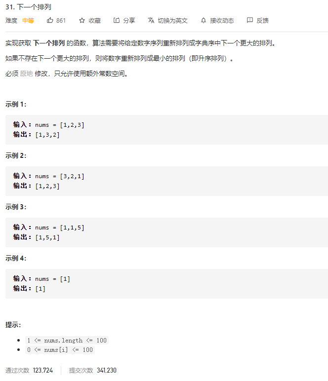

### leetcode_31_medium_下一个排列



```c++
class Solution {
public:
    void nextPermutation(vector<int>& nums) {
        
    }
};
```

#### 算法思路

将给定数字序列，重新排列成**下一个**更大的排列。新排列既要比原排列大，又要尽可能地接近，那么，也就是尽可能地改变原排列的低位元素，不动高位元素。

举个例子，数字序列[3,6,7,6,5,5,3] 。

1.  对于这个序列的后五个元素[7,6,5,5,3]，由于它们已经是按照降序排列的了，所以 无论如何改变它们的排列次序，都无法获得更大的排列。
2. 当访问到下一个元素6的时候，[6,7,6,5,5,3]不再是降序排列。
3. 找到降序数组当中刚好严格大于6的元素，此例中为7。交换这两个元素，得到[3，7,6,6,5,5,3]。
4. 由于高位已经变成了7，增大了。所以，重新排列低位，使得他们呈升序。新的排列为[3,3,5,5,6,6,7]

对于一般情况，代码实现是类似的。可以先提前检测数组是否纯降序。

```c++
class Solution {
public:
	void nextPermutation(vector<int>& nums) {
		int i,highPos;
		//判断是否为降序数组
		for (i = 0; i < nums.size()-1; i++)
		{
			if (nums[i] < nums[i + 1])
				break;
		}
		if (i == nums.size() - 1)
		{
			reverse(nums, 0, nums.size() - 1);  //如果是纯降序数组 则翻转降序数组
			return;
		}
		//找到升序数组的末尾
		for (i = nums.size() - 2; i >= 0; i--)
		{
			if (nums[i] < nums[i + 1])
				break;
		}
		highPos = i;
		//高位换成一个更大的值
		for (i = nums.size() - 1; i > highPos; i--)
		{
			if (nums[i] > nums[highPos])
			{
				int temp = nums[i];
				nums[i] = nums[highPos];
				nums[highPos] = temp;
				break;
			}
		}
		//高位后面的元素取反
		reverse(nums, highPos + 1, nums.size() - 1);
	}

	//翻转[left,right]之间的元素
	void reverse(vector<int>& nums, int left, int right)
	{
		int temp;
		if (left > nums.size() || right > nums.size())
			return;
		while (left < right)
		{
			temp = nums[left];
			nums[left] = nums[right];
			nums[right] = temp;
			left++;
			right--;
		}
	}
};
```

