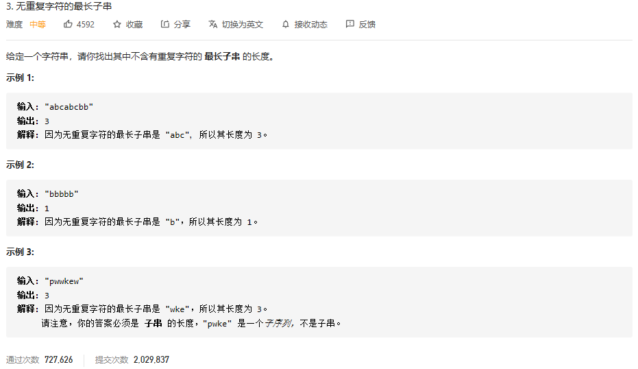

### leetcode_3_medium_无重复字符的最长子串




```c++
/**
 * Definition for singly-linked list.
 * struct ListNode {
 *     int val;
 *     ListNode *next;
 *     ListNode() : val(0), next(nullptr) {}
 *     ListNode(int x) : val(x), next(nullptr) {}
 *     ListNode(int x, ListNode *next) : val(x), next(next) {}
 * };
 */
class Solution {
public:
    ListNode* addTwoNumbers(ListNode* l1, ListNode* l2) {
        
    }
};
```

dp的思路。访问到字符串的每一个字符时，都计算以该字符作为子串右端点，最长子串的长度。

更新左端点的唯一判据，即为 使得子串中无重复字母。


```c++
class Solution {
public:
	int lengthOfLongestSubstring(string s) {
		int i, result = 0;
		int l = 0, r = 0;  //l-子串左端点下标 r-子串右端点下标
		vector<int> letterPos(256, -1);  //存储字符最近一次出现的位置

		for (r = 0; r < s.size(); r++)
		{
			if (letterPos[s[r]] >= l)
			{
				l = letterPos[s[r]] + 1;  //将该字符排除出子串
			}
			letterPos[s[r]] = r;
			result = max(result, r - l + 1);
		}
		return result;
	}
};
```

