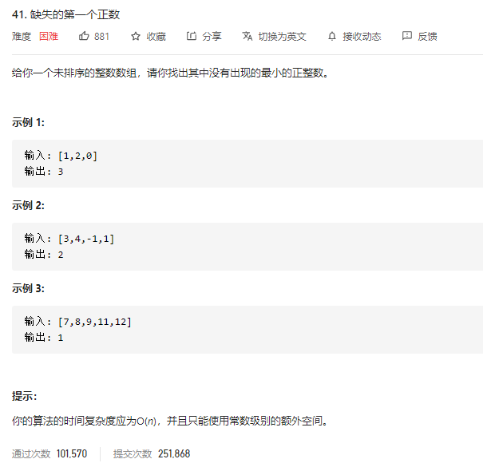
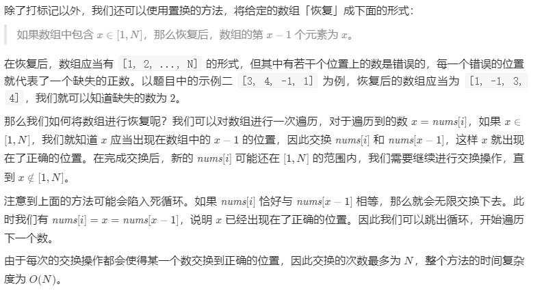

### leetcode_41_hard_缺失的第一个正数



```c++
class Solution {
public:
    int firstMissingPositive(vector<int>& nums) {

    }
};
```

#### 置换法

注意到要求时间复杂度O(n)，空间复杂度O(1)，所以只能扫描一遍，且不能新建一个一样大的数组。所以，考虑原地操作。

“找出其中没有出现的最小正整数”，记这个正整数为result，那也就是说，[1,result-1]这些正整数，都是出现在了数组中。先扫描一遍数组，将[1,result-1]这些正整数都放在第[1,result-1]这些位置上。之后，再扫描一遍，看到哪个位置没有对应的元素，则这就是没有出现的最小正整数

##### 增加一个元素

例如，nums={0,1,2,3,4}，应该是指针迭代到index=5，发现nums[5]!=5，最后返回结果5的。因此 需要增添一个元素，将nums增补为{0,1,2,3,4,-1}，从而避免指针下标访问越界。

##### 第一遍扫描

沿着下标i扫描整个数组。当扫描到第i个元素时，认为前i-1个元素都已经处理完毕。

对于每一个元素nums[i]，有四种情况

- i<nums[i]<=size  这意味着nums[i]应该插入第nums[i]个位置。但是，第nums[i]个位置的元素尚未被讨论过，不应该覆盖这个位置的元素。所以，变通的方法是，将第i个元素与第nums[i]个元素的位置互换。
  - 如果第i个元素和第nums[i]个元素不同的话，这么互换就相当于是先处理第nums[i]个元素。而第nums[i]个元素可能就不会引起上述问题
  - **如果第i个元素和第nums[i]个元素相同的话，放弃处理**。nums[i]这个数可以等到访问到nums[nums[i]]的时候再处理
- nums[i]<=0  算法只关心正整数，直接跳过即可
- nums[i]>size   注意，这里的size指的是原始nums.size()，而不是我们增补一个-1之后的size。   考虑长度为size的原始数组，它最多同时覆盖[1,size]这些元素。所以  如果原数组中有一个nums[i]>size，那么第一个缺失的正整数肯定是在[1,size]这个范围内。因此  这个nums[i]也就无需讨论。跳过即可
- 1<=nums[i]<=i   因为i之前的位置的元素都讨论过了，所以，nums[i]可以直接覆盖到第nums[i]个位置上

```c++
class Solution {
public:
	int firstMissingPositive(vector<int>& nums) {
		int i,size=nums.size();
		if (nums.empty())
			return 1;
		nums.push_back(-1);  //增加一个元素,避免越界
		//第一遍扫描，把元素放到它应在的位置上
		for (i = 0; i < size; i++)
		{
			while (nums[i] > i&&nums[i] <= size)  //当nums[i]需要插入到后面的位置时  与该位置的元素互换
			{
				if (nums[i] == nums[nums[i]])  //如果两个数相同，则无需交换，交换也没有意义
					break;
				swap(nums[i], nums[nums[i]]);  //交换下标为i,下标为nums[i]的元素
			}
			if (nums[i] <= 0)  //仅讨论正整数
				continue;
			else if (nums[i] > size)  //数组最多同时覆盖[1,size]这些正整数，故size+1无需讨论
				continue;
			else  //此时 1<=nums[i]<=i，由于i之前的位置都讨论过了，所以可以将其覆盖
			{
				nums[nums[i]] = nums[i];
			}
		}
		//第二遍扫描 找到第一个未正常出现的正整数
		for (i = 1; i < size+1; i++)
		{
			if (nums[i] != i)
				break;
		}
		return i;
	}
};
```

#### 简化的置换法

参照leetcode官方题解置换法



和上述的我的算法，区别在于：

- 规定数值为x的元素放在x-1的位置
- 总是进行交换操作，直到nums[nums[i] - 1] != nums[i]为止。除非当前数值小于等于0或大于n。这样使得每次交换都把一个数送到正确的位置。

也就是说，这个的思路是，逐个操作，使得nums的每个位置都是对应的元素。要么nums[i]=i-1，要么该位置有问题。

