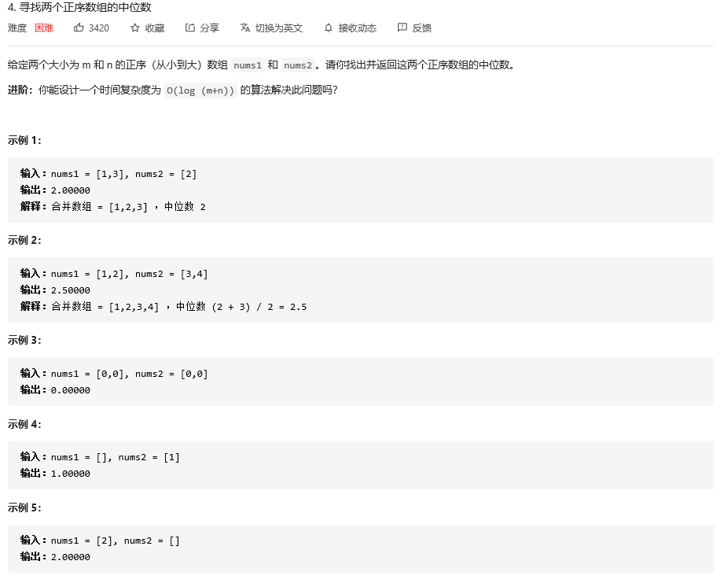
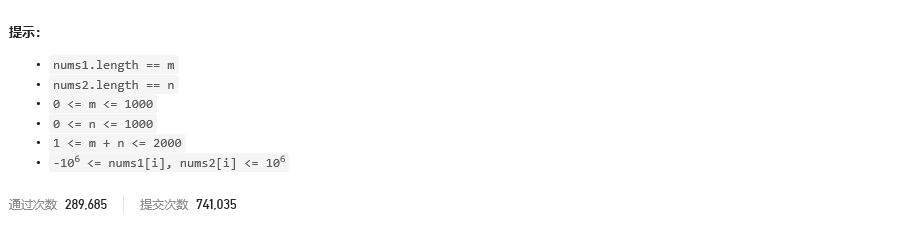
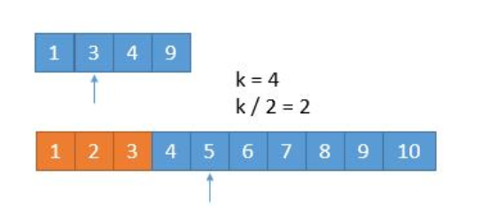
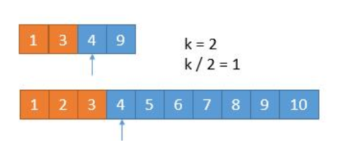
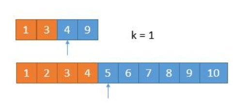

### leetcode_4_hard_寻找两个正序数组的中位数





```c++
class Solution {
public:
    double findMedianSortedArrays(vector<int>& nums1, vector<int>& nums2) {

    }
};
```

对于有序数组寻找中位数，只要求中间位置的数即可，时间复杂度O(1)。

对于题目中，两个有序数组求中位数，要求时间复杂度O(log(m+n))，则考虑二分查找法。

求中位数，也即求第k小的数，其中k=数组长度/2。因此，考虑使用二分法排除比第k个小的元素

[]: https://leetcode-cn.com/problems/median-of-two-sorted-arrays/solution/xiang-xi-tong-su-de-si-lu-fen-xi-duo-jie-fa-by-w-2/	"leetcode题解"

#### 题解的方法

参考leetcode非官方题解。 解法三

本题描述中，数组下标一律从0开始。

1. 对于下图所示的两个有序链表，长度分别为size(A)=4和size(B)=10。那么，问题即为求第k小的元素，其中k=77UIC4C$[PXLTK7.png)

2. 接上图。k/2=3（向下取整）。比较两个数组的前3个元素。A[2]=4，B[3]=3。A[2]>B[2]。则B[0]、B[1]、B[2]都不可能是第k小的元素，可以排除。将1 3 4 9和4 5 6 7 8 9 10两个数组作为新的数组进行比较。橙色部分表示已经去掉的数字。

3. 接上图。接下来 只要找第k-k/2小的数字即可，即7-3=4，第4小的数字。比较A[1]=3，B[4]=5，所以去掉A数组目前的前2个元素

4. 接上图。现在只需寻找第2小的元素。A,B的首元素大小相同，任意去掉其一即可。

   在计算过程中，可能遇到第k/2个元素超过数组长度的情况。那么，将指针指到数组末尾即可

#### 我的方法

上述题解的思路供参考，具体实现以下面的代码为准

1. 首先，计算需要的第k小的元素，**k如何计算**。以及相应的 需要移除的小于该元素的元素数量elemLeft
2. 当**elemLeft>=2**时，用二分查找法，排除elemLeft/2个元素。注意**防止数组下标越界**。
3. 如果两个数组其中一个的**元素全被排除**，需要**跳出二分查找**。去剩下的一个数组中排除剩余的elemLeft个元素。
4. 当结束二分查找之后，可能还有一个元素未被排除，需排除这个元素
5. 最后，根据总元素的数量，找到中间一个元素or中间两个元素的均值

```c++
class Solution {
public:
	double findMedianSortedArrays(vector<int>& nums1, vector<int>& nums2) {
		int k;  //寻找两个数组中 第k小的元素
		int elemLeft;  //需要移除的元素数量
		int pos1, pos2;  //nums1,nums2当中 等待被移除的子串右端点下标
		int size1=nums1.size(),size2=nums2.size(),l1=0, l2=0;  //nums1,nums2数组中，左端点的起始位置
		double median1,median2;  //中位数位置可能出现的1或2个元素

		k = (nums1.size() + nums2.size() - 1) / 2;  //寻找第k小的元素(从0开始数)  例如：size1=1,size2=3时，第1个元素；size1=2,size2=3时，第2个元素
		elemLeft = k;  //则移除k个数

		//nums1,nums2都有剩余元素,且剩余的需移除元素>=2时,使用二分查找
		while (elemLeft >= 2 && l1 < size1&&l2 < size2)
		{
			pos1 = min(size1 - 1, l1 + elemLeft / 2 - 1);  //计算待移除的数组右边界，且保证不能越界
			pos2 = min(size2 - 1, l2 + elemLeft / 2 - 1);  //计算待移除的数组右边界，且保证不能越界
			if (nums1[pos1] <= nums2[pos2])  //移除nums1当中的元素
			{
				elemLeft -= pos1 - l1 + 1;  //移除nums1[l1,pos1]区间的元素
				l1 = pos1 + 1;  //更新nums1左端点

			}
			else  //移除nums2当中的元素
			{
				elemLeft -= pos2 - l2 + 1;  //移除nums2[l2,pos2]区间的元素
				l2 = pos2 + 1;  //更新nums2左端点
			}
		}

		//在nums1元素全被排除后,剩余元素从nums2中排除
		if (l1 == size1)
		{
			l2 += elemLeft;
			elemLeft = 0;
		}
		//在nums2元素全被排除后,剩余元素从nums1中排除
		if (l2 == size2)
		{
			l1 += elemLeft;
			elemLeft = 0;
		}
		//排除二分法无法排除的剩余0~1个元素
		while (elemLeft > 0)
		{
			nums1[l1] <= nums2[l2] ? l1++ : l2++;
			elemLeft--;
		}

		//找到唯一的中位数，或者两个中位数中较小的一个
		if (l1 < size1&&l2 < size2)  //如果两个数组都没全被排除
			median1 = nums1[l1] < nums2[l2] ? nums1[l1++] : nums2[l2++];
		else
			median1 = l1 < size1 ? nums1[l1++] : nums2[l2++];
		//根据总数的奇偶 返回对应的中位数
		if ((size1 + size2) % 2 == 0)  //如果有第二个中位数，找到两个中位数中较大的一个
		{
			if (l1 < size1&&l2 < size2)
				median2 = nums1[l1] < nums2[l2] ? nums1[l1++] : nums2[l2++];
			else
				median2 = l1 < size1 ? nums1[l1++] : nums2[l2++];
			return (median1 + median2) / 2;
		}
		else
			return median1;
	}
};
```

