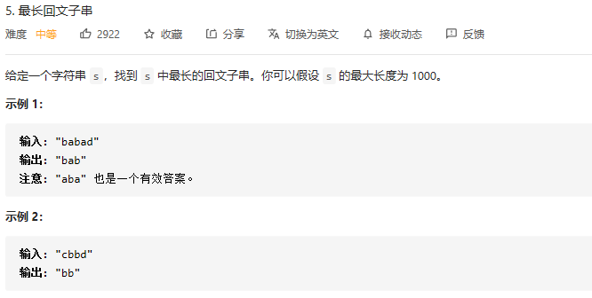

### leetcode_5_medium_最长回文子串



```c++
class Solution {
public:
    string longestPalindrome(string s) {

    }
}; 
```

#### 我的思路

首先思考是否能 仅仅扫描一遍就找出最长回文子串。

当扫描到第i个字符的时候，判断s[i,i]，s[i,i+1]，s[i,i+2]...是否是回文子串。时间复杂度为O(n^3)。

注意到，回文子串的特点是，以中心元素为对称轴对称。因此，可以判断以第i个元素为中心元素，分别向左右扩展，最长可以获得多长的回文子串，时间复杂度O(n^2)。

注意，区分回文串长度是奇数/偶数，分情况讨论

```c++
class Solution {
public:
	string longestPalindrome(string s) {
		int i,l,r,maxLength = 0;
		string result="";
		for (i = 0; i < s.size(); i++)
		{
			l = r = i;
			if (getLongest(s, l, r) > maxLength)  //查看以i为中心的回文子串
			{
				maxLength = r - l + 1;
				result = s.substr(l, r - l + 1);
			}
			l = i;
			r = i + 1;
			if (getLongest(s, l, r) > maxLength)  //查看以i,i+1为中心的回文子串
			{
				maxLength = r - l + 1;
				result = s.substr(l, r - l + 1);
			}
		}
		return result;
	}
	
	//从s[l,r]开始 向两侧扩展，找到最长子数组,返回子数组长度
	int getLongest(string& s, int& l, int& r)
	{
		int maxLength = 0;
		while (l >= 0 && r < s.length() && s[l] == s[r])
		{
			maxLength = r - l + 1;
			l--;
			r++;
		}
		l++;
		r--;
		return maxLength;
	}
};
```

