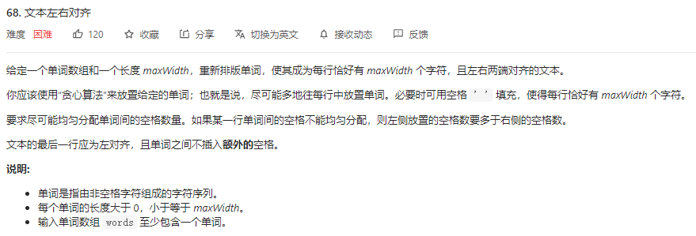
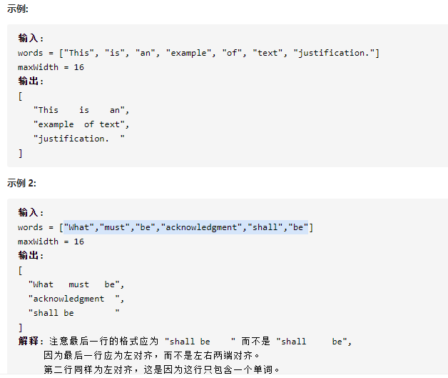
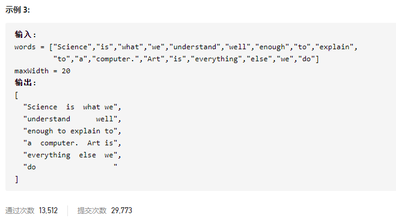

### leetcode_68_hard_文本左右对齐







```c++
class Solution {
public:
    vector<string> fullJustify(vector<string>& words, int maxWidth) {

    }
};
```

#### 算法思路

讨论的要点是，对于每一行，都添加尽可能多数量的单词。下面描述每一行需要做些什么

1. 按照题意，每一行都至少有一个单词。所以，先添加这个单词
2. 计算当前行还能添加多少个单词。每添加一个单词，都需要占用word.size()+1的空间，因为还要至少一个字符 来与前一个单词分隔。
3. 真正地为这一行添加单词。
   - 如果是最后一行，则左对齐，即单词之前只插入一个空格
   - 如果不是最后一行
     - 如果这行仅有1个单词，则将剩余空格插到行尾
     - 如果这行有至少2个单词，将剩余的空格均匀地分布在每个单词之间

##### 向上取整

整数相除，向上取整的trick。对于正整数a、b，计算a/b，**令c=(a+b-1)/b即实现了向上取整**。本题中没用到

```c++
class Solution {
public:
	vector<string> fullJustify(vector<string>& words, int maxWidth) {
		int lineIndex, wordIndex, wordRange, posLeft, spaceLeft, intervalLength;
		int wordsNum = words.size();
		string curLine;
		vector<string> result;

		wordIndex = 0;  //当前待处理的单词下标
		wordRange = 0;  //本行可以加入的单词下标右边界(不包含)
		while (wordIndex < wordsNum)  //外层循环 处理每一行
		{
			posLeft = maxWidth;  //当前行剩下的空位
			curLine = "";
			/*******添加一个单词*********/
			posLeft -= words[wordIndex].size();
			curLine += words[wordIndex];
			wordIndex++;
			wordRange++;
			/*******讨论当前行可以放多少个单词*********/
			while (wordRange < wordsNum && words[wordRange].size() + 1 <= posLeft)  //讨论wordRange处的单词是否应该加入该行
			{
				posLeft -= words[wordRange].size() + 1;
				wordRange++;
			}
			/*******添加剩余的单词*********/
			posLeft += wordRange - wordIndex;  //现在剩余的位置 也就相当于是要添加的空格的数量
			if (wordRange == wordsNum)  //如果这是最后一行 则左对齐
			{
				for (; wordIndex < wordRange; wordIndex++)
				{
					curLine += ' ';
					curLine += words[wordIndex];
					posLeft--;
				}
				curLine += string(posLeft, ' ');
			}
			else  //如果不是最后一行 则分散对齐
			{
				if (wordIndex < wordRange)  //如果有至少2个单词，则将空格均匀地分布在单词之间
				{
					intervalLength = posLeft / (wordRange - wordIndex);  //计算单词与单词之间还要添加多少空格。因为"左侧放置的空格数要多余右侧的空格数"，所以先向下取整
					posLeft -= intervalLength*(wordRange - wordIndex);  //为单词之间分配固定长度的空档之后,posLeft代表剩余的空格数
					//前面若干个单词，间距较大
					for (; posLeft > 0; wordIndex++)
					{
						curLine += string(intervalLength + 1, ' ');
						curLine += words[wordIndex];
						posLeft--;
					}
					//后面若干个单词，间距较小
					for (; wordIndex < wordRange; wordIndex++)
					{
						curLine += string(intervalLength, ' ');
						curLine += words[wordIndex];
					}
				}
				else  //如果只有1个单词，将空格放到这一个单词之后
				{
					curLine += string(posLeft, ' ');
				}
			}
			/*******为结果添加该行*********/
			result.push_back(curLine);
		}
		return result;
	}
};
```

