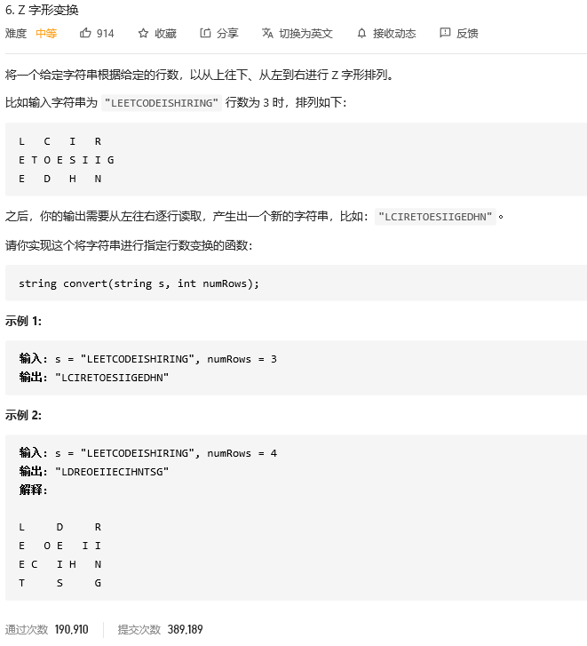

### leetcode_6_medium_Z字形变换



```c++
class Solution {
public:
    string convert(string s, int numRows) {

    }
};
```

Z字变换，注意到可以将一个Z字的前半部分作为一个周期。如示例2中，LEETCO即为一个周期。之后按行排列，*即为分别取每个周期中的某些元素

注意：

- 最上一行、最下一行，由于每个周期只有一个元素。中间行，每个周期有两个元素 处理方法不同
- 取指定行的元素时，计算字母下标用累加的方式，而非计算乘法，可以提高运算效率

```c++
class Solution {
public:
	string convert(string s, int numRows) {
		int cycleLength, cycleNum,cycleIndex,l,r,y; 
		int totalLength = s.length();
		string result;
		if (numRows == 0)
			return "";
		else if (numRows == 1)
			return s;
		cycleLength = numRows * 2 - 2;  //每个周期的字符数
		cycleNum = totalLength / cycleLength;  //周期的数量(向上取整)
		if (totalLength - cycleLength * cycleNum > 0)
			cycleNum++;

		//最上一行
		for (cycleIndex = 0,l=0; cycleIndex < cycleNum; cycleIndex++)
		{
			result += s[l];
			l += cycleLength;
		}
		//中间行
		for (y = 1; y < numRows - 1; y++)
		{
			l = y;
			r = cycleLength - y;
			for (cycleIndex = 0; cycleIndex < cycleNum; cycleIndex++)
			{
				if (l < totalLength)
					result += s[l];
				if (r < totalLength)
					result += s[r];
				l += cycleLength;
				r += cycleLength;
			}
		}
		//最下一行
		for (cycleIndex = 0, l = numRows-1; cycleIndex < cycleNum; cycleIndex++)
		{
			if (l < totalLength)
				result += s[l];
			l += cycleLength;
		}
		return result;
	}
};
```

