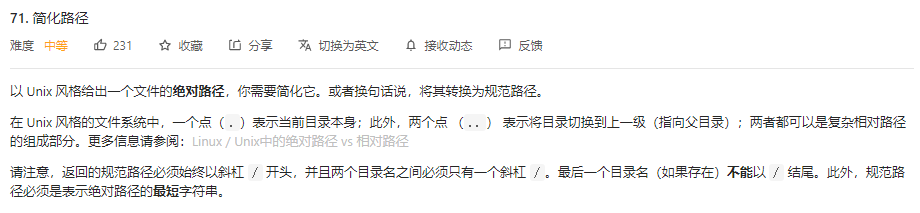
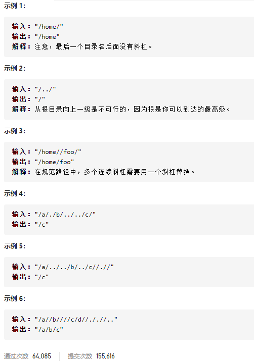

### leetcode_71_medium_简化路径





#### 算法思路

路径是一个层级结构。可以认为路径的每一层，都对应一个子字符串，该子串的终点是'/'或者字符串尾。例如，示例5，可以认为是以下 层路径["a","..","..","b","..","c",".']。

1. 为了统一判断子串结尾的标志，所以将所有原始路径的末尾都添加一个'/'
2. 将字符串拆解为一层层的子串，更新路径列表
   - 如果子串为常规字符集，则添加进路径列表
   - 如果子串是切换到上级目录"../"，则移除路径列表的末位元素（前提是路径列表非空）
   - 如果子串是当前目录"./"，则维持路径列表不动
3. 将路径列表翻译为规范路径

##### unix路径规则

参考https://blog.csdn.net/u011327334/article/details/50355600

一个点（`.`）表示当前目录本身；此外，两个点 （`..`） 表示将目录切换到上一级（指向父目录）。例如三个点（`...`)是合法路径名。

```c++
class Solution {
public:
	string simplifyPath(string path) {
		int l, r, i;
		string result;
		vector<string> dirs;

		
		/***********统一子串末尾为'/'***********/
		path += '/';
		/***********求路径列表*****************/
		l = 0;  //当前处理的子字符串左端点(包含)
		r = 0;  //当前处理的子字符串右端点(包含)
		dirs.push_back("");  //表示根目录
		while (r < path.size())
		{
			//更新当前子串范围
			while (path[r] != '/')
				r++;
			//处理当前子串
			if (l == r)  //重复的'/'
				;
			else if(r-l==2 && path[r - 2] == '.'&&path[r - 1] == '.')  //向上一级
			{
				if (dirs.size()>1)  //不能删除根目录
					dirs.pop_back();
			}
			else if (r-l==1 && path[r - 1] == '.')  //当前目录
				;
			else  //正常的一级目录
				dirs.push_back(path.substr(l, r - l));
			//初始化下一个子串范围
			r++;
			l = r;
		}
		/***********生成规范路径*****************/
		for (i = 0; i < dirs.size(); i++)
		{
			result += dirs[i];
			result += '/';
		}
		if(result.size()>1)
			result.erase(result.size() - 1);  //移除末尾的'/'
		return result;
	}
};
```

