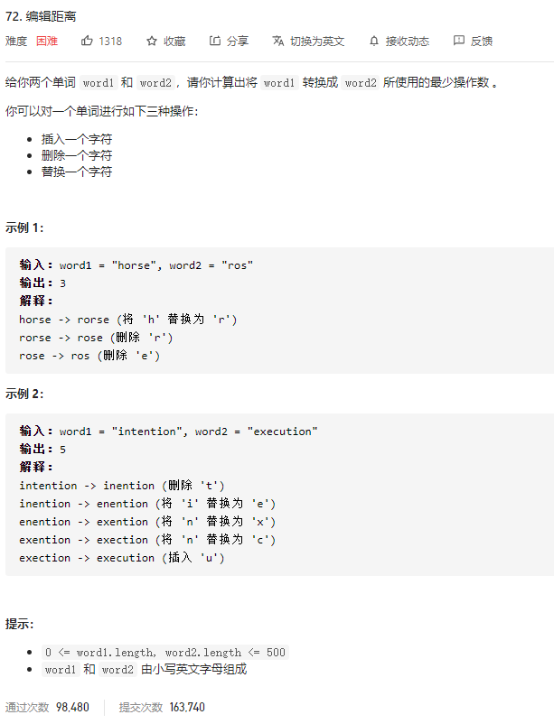

### leetcode_72_hard_编辑距离



```c++
class Solution {
public:
    int minDistance(string word1, string word2) {

    }
};
```

#### 算法思路

找到word1和word2的最长公共子序列wordCommon。word1删除若干字符，变为wordCommon，再加上若干字符，变为word2。

构造dp数组distance[i] [j]，记录words1的前i个字符，转换为words2的前j个字符 所需的最少操作数。讨论状态转移方程

- distance[i] [0]=i。需要减去i个字符
- distance[0] [j]=j。需要添加j个字符
- 对于distance[i] [j]，i>0且j>0
  - 如果words[i]==words[j]，可以以distance[i-1] [j-1]的转换方式为基础，添加words[i]这个字符，就构成了distance[i] [j]的转换
  - 可以以distance[i-1] [j-1]

#### 另一种dp

构造dp数组 dp[i] [j]，表示word1的前i个字符 与word2的前j个字符，他们的 最长公共子序列的长度

讨论状态转移方程

- dp[i] [0]=0
- dp[0] [j]=0
- 对于dp[i] [j]，i>0且j>0
  - 如果word1[i]==word2[j]，则dp[i] [j]=dp[i-1] [j-1]+1
  - 其他情况，dp[i] [j]=max(dp[i-1] [j],dp[i] [j-1])

算法的思想是，将word1与word2的最长公共子串保留。改变其他部分（增加、删除、或替换元素），从而将word1变为word2