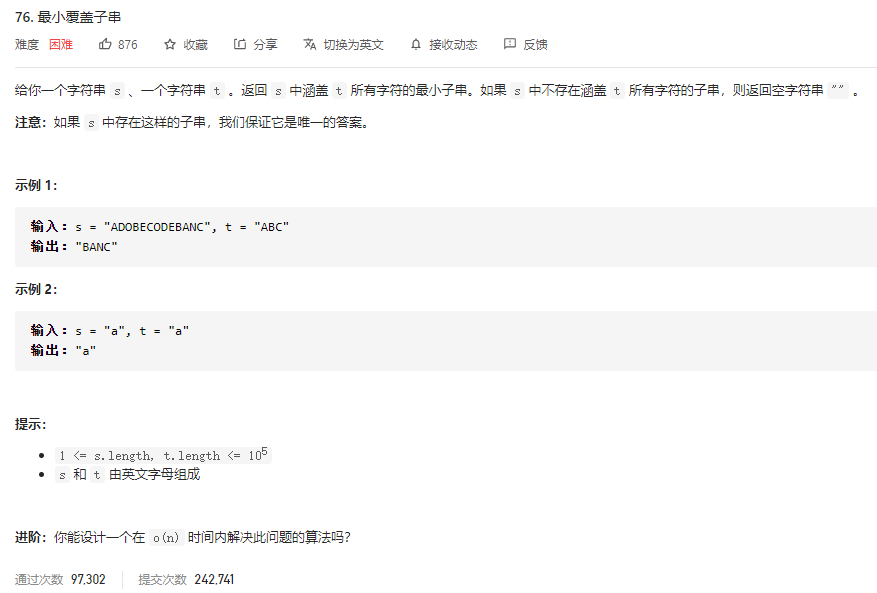

### leetcode_76_hard_最小覆盖子串



```c++
class Solution {
public:
    string minWindow(string s, string t) {

    }
};
```

#### 算法思路

构造数组  charNum[]维护每个字符需要出现的次数，charNeed[]维护每个字符在子串中已经出现的次数

维护两个指针left,right。

1. 扫描字符串t，记录每个字符出现的次数charNeed
2. 右移right指针，随之更新charFound，直到每个字符都出现了足够的次数。如果没找到，则返回""
3. 右移left指针，直到刚好满足覆盖charNum。记录此时的满足要求的子串result = s.substr(left, right - left + 1);
4. 继续右移right指针，并随之更新left指针，讨论是否有更短的覆盖子串

```c++
class Solution {
public:
	string minWindow(string s, string t) {
		int i, left, right, numNotCovered;
		int charNeed[127];  //记录t中各个字符出现了几次
		int charFound[127];  //记录当前子串中各个字符出现了几次(仅讨论出现在了t中的字符)
		string result;

		numNotCovered = t.size();  //尚未被包含进子串的字符数量
		memset(charNeed, 0, sizeof(int) * 127);  //t中每个字符的数量初始化为0
		memset(charFound, 0, sizeof(int) * 127);  //子串中每个字符的数量初始化为0
		//统计各个字符出现的次数
		for (i = 0; i < t.size(); i++)
			charNeed[t[i]]++;
		//扩展右指针，找到覆盖t的子串
		for (right = 0; right < s.size(); right++)
		{
			charFound[s[right]]++;
			if (charFound[s[right]] <= charNeed[s[right]])
			{
				numNotCovered--;
				if (numNotCovered == 0)
					break;
			}
		}
		if (right == s.size())  //没找到
			return result;
		//扩展左指针，使目前子串尽可能小
		for (left = 0; left < right; left++)
		{
			if (charFound[s[left]] == charNeed[s[left]])
				break;
			charFound[s[left]]--;
		}
		result = s.substr(left, right - left + 1);
		//继续扩展右指针，寻找下一个覆盖子串
		for (right++; right < s.size(); right++)
		{
			charFound[s[right]]++;
			if (charNeed[s[right]] > 0)  //尝试右移左指针
			{
				while (charFound[s[left]] > charNeed[s[left]])
				{
					charFound[s[left]]--;
					left++;
				}
				if (right - left + 1 < result.size())  //如过找到了更小的子串 更新result
					result = s.substr(left, right - left + 1);
			}
		}
		return result;
	}
};
```

