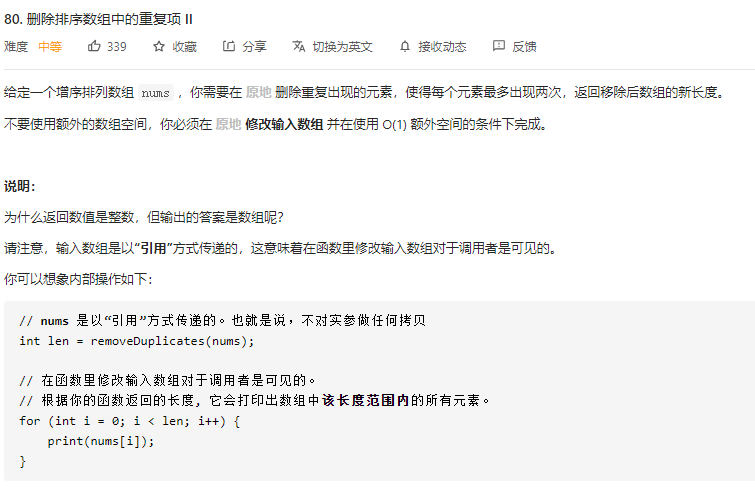
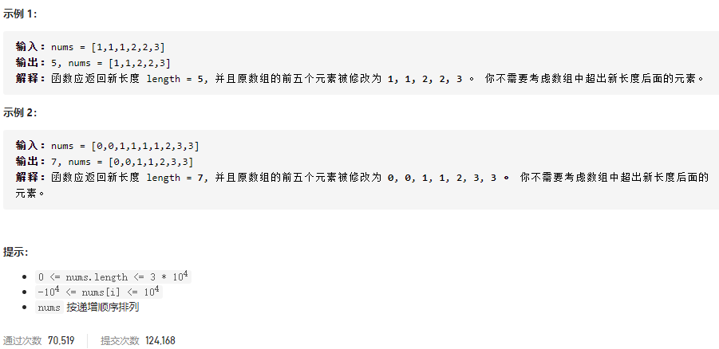

### leetcode_80_medium_删除排序树组中的重复项





```c++
class Solution {
public:
    int removeDuplicates(vector<int>& nums) {

    }
};
```

#### 算法思路

维护两个指针。p：指向已经修正完毕的数组的后一个元素。i：指向当前正在处理的元素

判断当前元素nums[i]是否已经出现了两次，通过判断nums[p-2]==nums[i]。如果上式成立，则已经有两份nums[i]了。

```c++
class Solution {
public:
	int removeDuplicates(vector<int>& nums) {
		int p, i;

		if (nums.size() <= 2)  //长度<=2的数组，不可能发生重复
			return nums.size();

		for (p = 2, i = 2; i < nums.size(); i++)
		{
			if (nums[i] == nums[p - 2])  //重复了超过2次
				continue;
			else
				nums[p++] = nums[i];
		}
		return p;
	}
};
```

