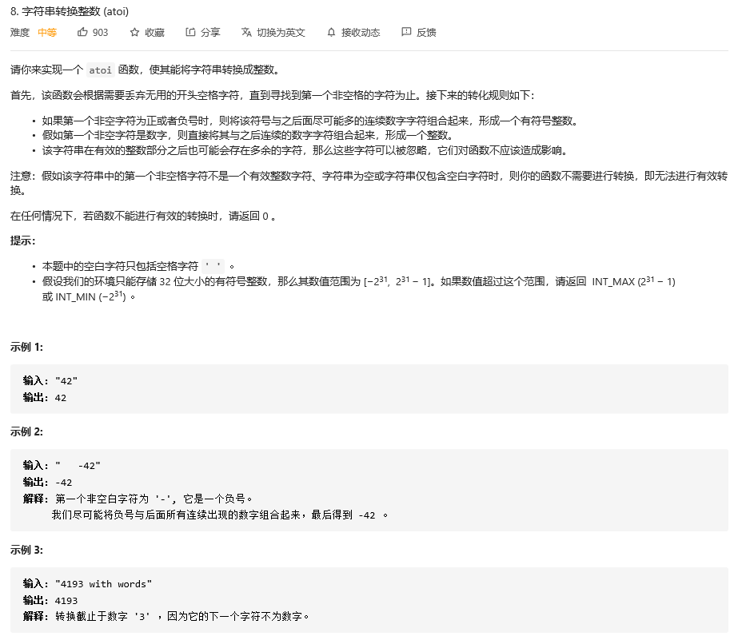

### leetcode_8_medium_字符串转换整数




判断上溢的条件非常刁钻。

INT_MAX=2147483647。

1. 如果认为result**>=**INT_MAX/10则上溢，则会挂在测试用例"2147483646"；
2. 如果认为result**>**INT_MAX/10则上溢，则会挂在测试用例“"2147483648”
3. 仔细考虑具体什么情况会溢出。当前计算出的数值为result，接下来会末尾加上一位数字digit，即需要判断result*10+digit>INT_MAX，即为溢出。
4. 因此 即为判断result*10>INT_MAX-digit(注意 这种判断方法在result>INT_MAX/10时判断不出来溢出，只是题目中没有这个测试用例)
5. 判断result>(INT_MAX-digit)/10

酌情判断是否要这样写。辣鸡题目

```c++
class Solution {
public:
	int myAtoi(string s) {
		bool positive = true, overflow = false;
		int i, result = 0, limit = INT_MAX / 10, digit;

		//排除无效字符
		for (i = 0; i < s.size(); i++)
		{
			if (s[i] == ' ')
				continue;
			else if ('0' <= s[i] && s[i] <= '9')
				break;
			else if (s[i] == '+')
			{
				positive = true;
				i++;
				break;
			}
			else if (s[i] == '-')
			{
				positive = false;
				i++;
				break;
			}
			else
				return 0;
		}
		//处理数
		for (result = 0; i < s.size(); i++)
		{
			if (s[i]<'0' || s[i]>'9')
				break;
			digit = s[i] - '0';
			if (result > (INT_MAX-digit)/10)
			{
				overflow = true;
				break;
			}
			result *= 10;
			result += digit;
		}
		
		if (overflow)
		{
			if (positive)
				return INT_MAX;
			else
				return INT_MIN;
		}

		if (positive)
			return result;
		else
			return -result;
	}
};
```

