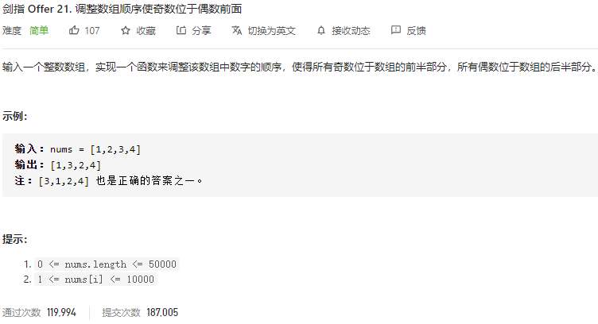

### 剑指offer_21_easy_调整数组顺序使奇数位于偶数前面



```c++
class Solution {
public:
    vector<int> exchange(vector<int>& nums) {

    }
};
```

#### 算法思路

把偶数置换到后面

```c++
class Solution {
public:
    vector<int> exchange(vector<int>& nums) {
        int l;  //下标l以及更左边的均为奇数
        int r;  //下标r以及更右边的均为偶数

        l=-1;
        r=nums.size();
        while(l<r)
        {
            ++l;
            while(l<r && isEven(nums[l]))
                swap(nums[l],nums[--r]);
        }
        return nums;
    }

    inline bool isEven(int number)
    {
        return number%2==0;
    }
};
```

