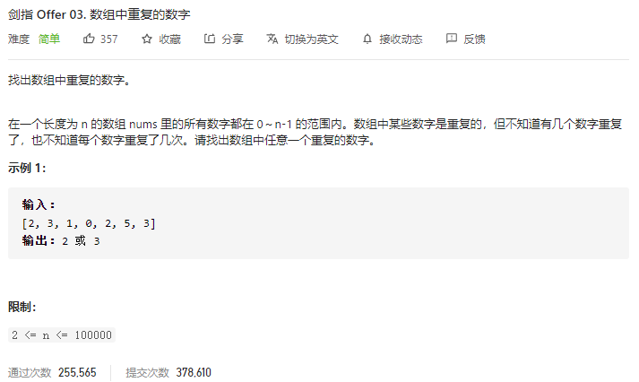

### 剑指offer_3_easy_数组中重复的数字



```c++
class Solution {
public:
    int findRepeatNumber(vector<int>& nums) {

    }
};
```

#### 算法思路

hash表

```c++
class Solution {
public:
    int findRepeatNumber(vector<int>& nums) {
        int i;
        unordered_map<int,int> count;  //各个数据出现的次数

        for(i=0;i<nums.size();i++)
        {
            if(++count[nums[i]]>1)
                return nums[i];
        }
        return -1;
    }
};
```

