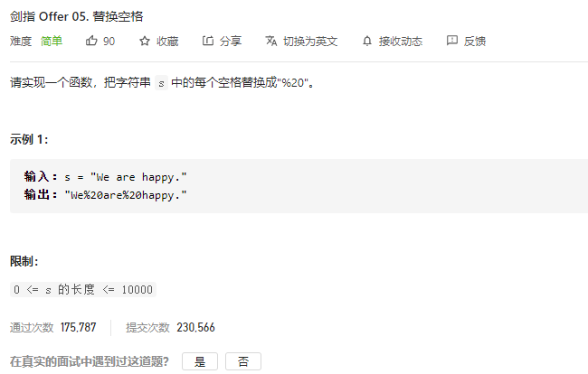

### 剑指offer_5_easy_替换空格



```c++
class Solution {
public:
    string replaceSpace(string s) {

    }
};
```

#### 算法思路

```c++
class Solution {
public:
    string replaceSpace(string s) {
        int l,r;
        string result;
        
        l=0;
        while(l<s.size())
        {
            if(s[l]==' ')  //空格对应 %20
            {
                result+="%20";
                l++;
            }
            else  //添加直到空格为止的部分
            {
                r=l+1;
                while(r<s.size()&&s[r]!=' ')
                    ++r;
                result+=s.substr(l,r-l);
                l=r;
            }
        }
        return result;
    }
};
```

