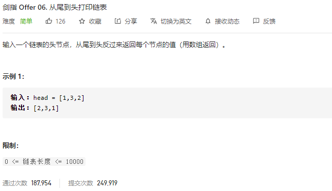

### 剑指offer_6_easy_从尾到头打印链表



```c++
class Solution {
public:
    vector<int> reversePrint(ListNode* head) {

    }
};
```

#### 算法思路

```c++
class Solution {
public:
    vector<int> reversePrint(ListNode* head) {
        ListNode *cur;
        vector<int> result;

        cur=head;
        while(cur)
        {
            result.push_back(cur->val);
            cur=cur->next;
        }
        reverse(result.begin(),result.end());
        return result;
    }
};
```

#### 