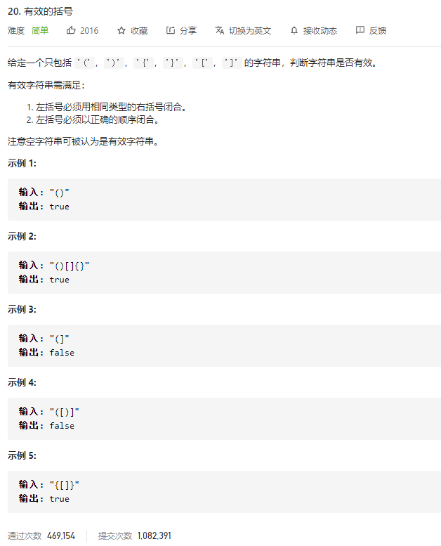

### leetcode_20_medium_有效的括号



```
class Solution {
public:
    bool isValid(string s) {

    }
};
```

#### 算法思路

使用栈。

后括号合法的条件是，堆栈不为空且栈顶元素是对应的前括号。

```c++
class Solution {
public:
	bool isValid(string s) {
		int i;
		char letter;
		stack<char> stack;
		for (i = 0; i < s.size(); i++)
		{
			letter = s[i];
			if (letter == '(' || letter == '{' || letter == '[')
				stack.push(letter);
			else if (letter == ')'&&!stack.empty()&&stack.top() == '(')
				stack.pop();
			else if (letter == '}'&& !stack.empty() && stack.top() == '{')
				stack.pop();
			else if (letter == ']'&& !stack.empty() && stack.top() == '[')
				stack.pop();
			else
				return false;
		}
		if (stack.empty())
			return true;
		else
			return false;
	}
};
```

