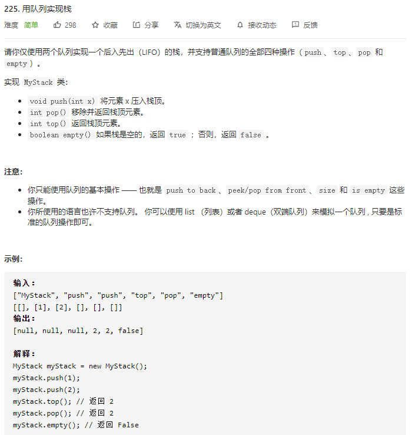
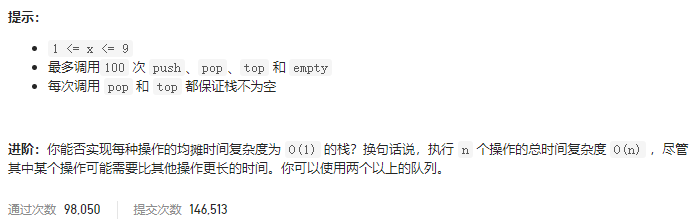

### leetcode_225_easy_用队列实现栈





```c++
class MyStack {
public:
    /** Initialize your data structure here. */
    MyStack() {

    }
    
    /** Push element x onto stack. */
    void push(int x) {

    }
    
    /** Removes the element on top of the stack and returns that element. */
    int pop() {

    }
    
    /** Get the top element. */
    int top() {

    }
    
    /** Returns whether the stack is empty. */
    bool empty() {

    }
};

/**
 * Your MyStack object will be instantiated and called as such:
 * MyStack* obj = new MyStack();
 * obj->push(x);
 * int param_2 = obj->pop();
 * int param_3 = obj->top();
 * bool param_4 = obj->empty();
 */
```

#### 算法思路

一个队列存储数据，队头代表栈顶，队尾代表栈底

另一个用于暂存数据，从而用于把数据插入栈顶(队头)

```c++
class MyStack {
public:
    /** Initialize your data structure here. */
    MyStack() {

    }
    
    /** Push element x onto stack. */
    void push(int x) {
        //数据暂存到另一个队列中
        while(!m_data.empty())
        {
            m_temp.push(m_data.front());
            m_data.pop();
        }
        //加入新元素
        m_data.push(x);
        //元素移回队列
        while(!m_temp.empty())
        {
            m_data.push(m_temp.front());
            m_temp.pop();
        }
    }
    
    /** Removes the element on top of the stack and returns that element. */
    int pop() {
        int result=m_data.front();
        m_data.pop();
        return result;
    }
    
    /** Get the top element. */
    int top() {
        return m_data.front();
    }
    
    /** Returns whether the stack is empty. */
    bool empty() {
        return m_data.empty();
    }

private:
    queue<int> m_data;
    queue<int> m_temp;
};
```

