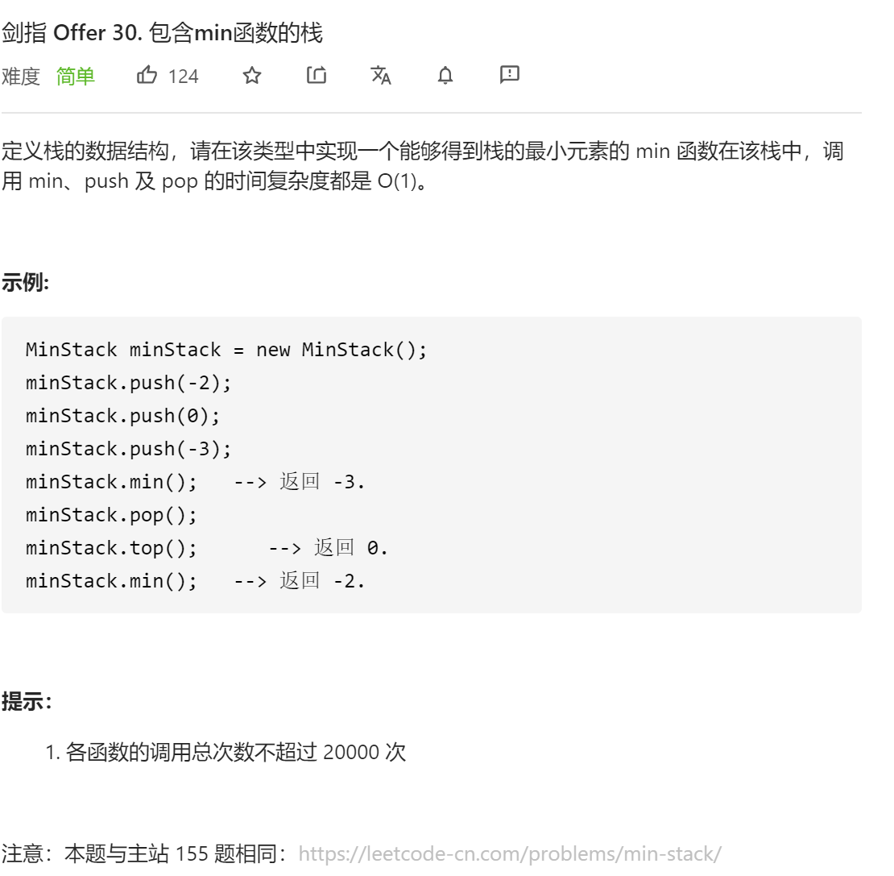

### 剑指offer_30_easy_包含min函数的栈



```c++
class MinStack {
public:
    /** initialize your data structure here. */
    MinStack() {

    }
    
    void push(int x) {

    }
    
    void pop() {

    }
    
    int top() {

    }
    
    int min() {

    }
};
```

#### 算法思路

同 leetcode_155_easy_最小栈

```c++
class MinStack {
public:
    /** initialize your data structure here. */
    MinStack() {

    }
    
    void push(int x) {
        m_data.push(x);
        if(m_minElem.empty()||x<=m_minElem.top())
            m_minElem.push(x);
    }
    
    void pop() {
        if(m_minElem.top()==m_data.top())
            m_minElem.pop();
        m_data.pop();
    }
    
    int top() {
        return m_data.top();
    }
    
    int min() {
        return m_minElem.top();
    }

private:
    stack<int> m_data;
    stack<int> m_minElem;
};
```

