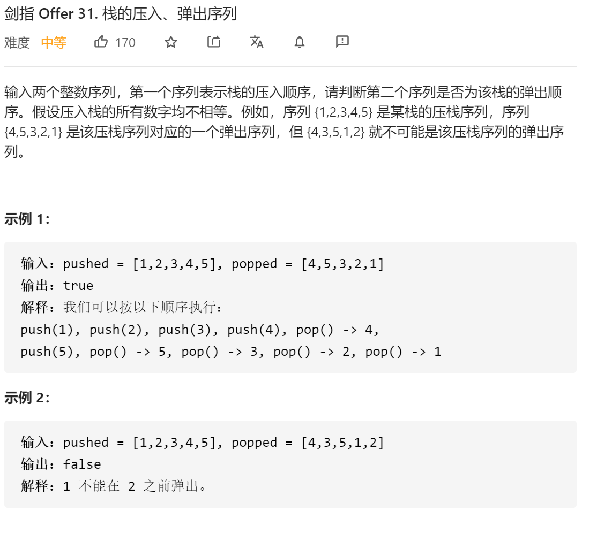
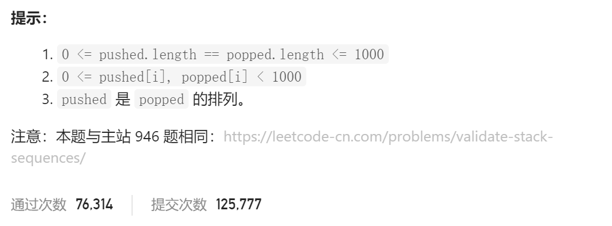

### 剑指offer_31_medium_栈的压入、弹出序列





```c++
class Solution {
public:
    bool validateStackSequences(vector<int>& pushed, vector<int>& popped) {

    }
};
```

#### 算法思路

同 leetcode_946_medium_验证栈序列

直接模拟堆栈的压入弹出过程

```c++
class Solution {
public:
    bool validateStackSequences(vector<int>& pushed, vector<int>& popped) {
        int i;  //处理pushed的第i个元素
        int j;  //指示当前将要处理popped的哪个元素
        stack<int> s;

        for(i=0,j=0;i<pushed.size();i++)
        {
            s.push(pushed[i]);
            while(!s.empty() && s.top()==popped[j])
            {
                s.pop();
                ++j;
            }
        }
        return s.empty();
    }
};
```

