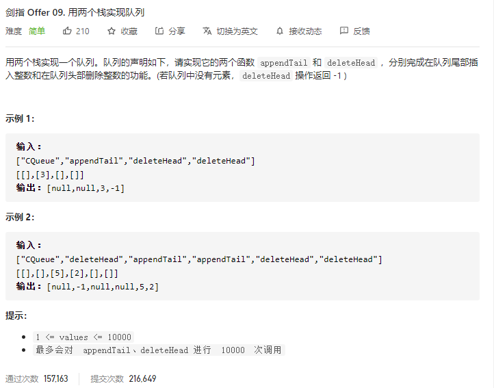

### 剑指offer_9_easy_用两个栈实现队列



```c++
class CQueue {
public:
    CQueue() {

    }
    
    void appendTail(int value) {

    }
    
    int deleteHead() {

    }
};
```

#### 算法思路

同 leetcode_232_easy_用栈实现队列。注意 使用两个栈来提高效率

```c++
class CQueue {
public:
    CQueue() {

    }
    
    void appendTail(int value) {
        inStack.push(value);
    }
    
    int deleteHead() {
        int result;

        if(outStack.empty())
            moveElem();
        if(outStack.empty())
            return -1;
        result=outStack.top();
        outStack.pop();
        return result; 
    }

private:
    //将数据由输入栈移至输出栈
    void moveElem()
    {
        while(!inStack.empty())
        {
            outStack.push(inStack.top());
            inStack.pop();
        }
    }
private:
    stack<int> inStack;  //数据输入后存放在输出栈
    stack<int> outStack;  //数据由输出栈输出

};
```

