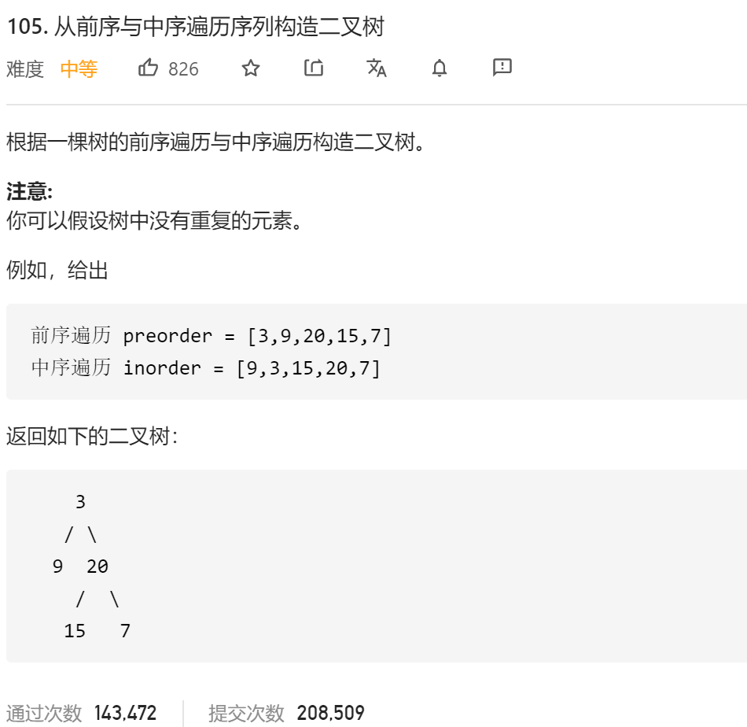

### leetcode_105_medium_从前序与中序遍历序列构造二叉树



```c++
class Solution {
public:
    TreeNode* buildTree(vector<int>& preorder, vector<int>& inorder) {
        
    }
};
```

#### 算法思路

**分治**的思想。例如，对于

> ```
> 前序遍历 preorder = [3,9,20,15,7]
> 中序遍历 inorder = [9,3,15,20,7]
> ```

preorder的第一个数，3，即为根节点。在inorder中找到3的位置，即可将3左边的[9]分为左子树，将3右边的[15,20,7]分为右子树。

之后再分别递归地处理左右子树即可

```c++
class Solution {
public:
	TreeNode* buildTree(vector<int>& preorder, vector<int>& inorder) {
		int i;
		for (i = 0; i < inorder.size(); i++)
			m_inorderPos[inorder[i]] = i;
		return buildSubTree(preorder, 0, preorder.size() - 1, inorder, 0, inorder.size() - 1);
	}

	TreeNode* buildSubTree(vector<int>& preorder, int preLeft, int preRight, vector<int>& inorder, int inLeft, int inRight)
	{
		int rootIndexInorder;  //子树根节点 在inorder中的下标
		TreeNode* result;
		//子树为空的特殊情况
		if (preLeft > preRight)
			return nullptr;
		rootIndexInorder = m_inorderPos[preorder[preLeft]];
		result = new TreeNode(preorder[preLeft]);
		//递归构造左子树
		result->left = buildSubTree(preorder, preLeft + 1, preLeft+rootIndexInorder-inLeft, inorder, inLeft, rootIndexInorder - 1);
		//递归构造右子树
		result->right = buildSubTree(preorder,preRight-inRight+rootIndexInorder+1 , preRight, inorder, rootIndexInorder + 1, inRight);
		
		return result;
	}

private:
	unordered_map<int, int> m_inorderPos;   //中序遍历数组中，各个数值的下标
};
```

