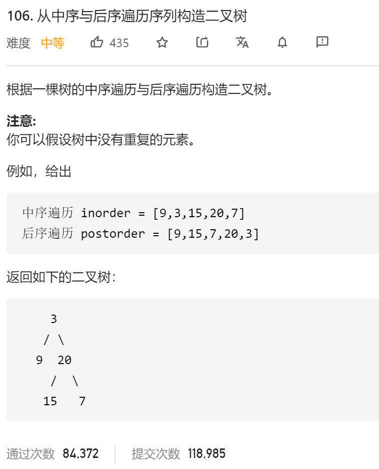

### leetcode_106_从中序与后序遍历序列构造二叉树



```c++
class Solution {
public:
    TreeNode* buildTree(vector<int>& inorder, vector<int>& postorder) {
        
    }
};
```

#### 算法思路

与 leetcode_105_从前序与中序遍历序列构造二叉树 类似。**分治**的思想，将树拆分为根节点、左子树、右子树，递归处理。

用后序遍历，找到子树的根节点。用根节点，在中序遍历序列中用于区分左右子树

```c++
class Solution {
public:
	TreeNode* buildTree(vector<int>& inorder, vector<int>& postorder) {
		int i;
		for (i = 0; i < inorder.size(); i++)
			m_inorderPos[inorder[i]] = i;
		return buildSubTree(inorder, 0, inorder.size() - 1, postorder, 0, postorder.size() - 1);
	}

	TreeNode* buildSubTree(vector<int>& inorder, int inLeft, int inRight, vector<int>& postorder, int postLeft, int postRight)
	{
		int rootIndexInorder;  //子树根节点 在inorder中的下标
		TreeNode* result;  //子树根节点
		//子树为空的特殊情况
		if (inLeft > inRight)
			return nullptr;
		//处理根节点
		result = new TreeNode(postorder[postRight]);
		rootIndexInorder = m_inorderPos[postorder[postRight]];
		//递归构造左子树
		result->left = buildSubTree(inorder, inLeft, rootIndexInorder - 1, postorder, postLeft, postLeft + rootIndexInorder - inLeft - 1);
		//递归构造右子树
		result->right = buildSubTree(inorder, rootIndexInorder + 1, inRight, postorder, postRight - inRight + rootIndexInorder, postRight - 1);
		
		return result;
	}

private:
	unordered_map<int, int> m_inorderPos;   //中序遍历数组中，各个数值的下标
};
```

