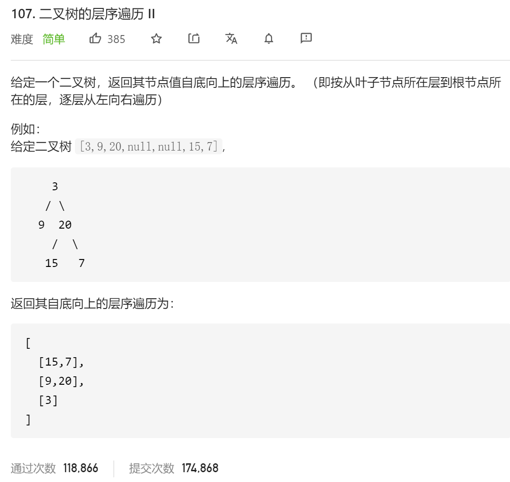

### leetcode_107_easy_二叉树的层序遍历Ⅱ



```c++
class Solution {
public:
    vector<vector<int>> levelOrderBottom(TreeNode* root) {
        
    }
};
```

#### 算法思路

与 leetcode_102_medium_二叉树的层序遍历.md 几乎一模一样。

在上题的基础上，翻转各层数据即可

```c++
class Solution {
public:
	vector<vector<int>> levelOrderBottom(TreeNode* root) {
		int i,curLineSize;  //当前行的节点数量
		TreeNode* curNode;
		queue<TreeNode*> q;
		vector<int> curLineData;  //当前行的节点数据
		vector<vector<int>> result;

		if (root == nullptr)
			return result;
		q.push(root);
		while (!q.empty())
		{
			curLineSize = q.size();
			curLineData.clear();
			for (i = 0; i < curLineSize; i++)
			{
				curNode = q.front();
				q.pop();
				curLineData.push_back(curNode->val);
				if (curNode->left)
					q.push(curNode->left);
				if (curNode->right)
					q.push(curNode->right);
			}
			result.push_back(curLineData);
		}
		reverse(result.begin(), result.end());
		return result;
	}
};
```

