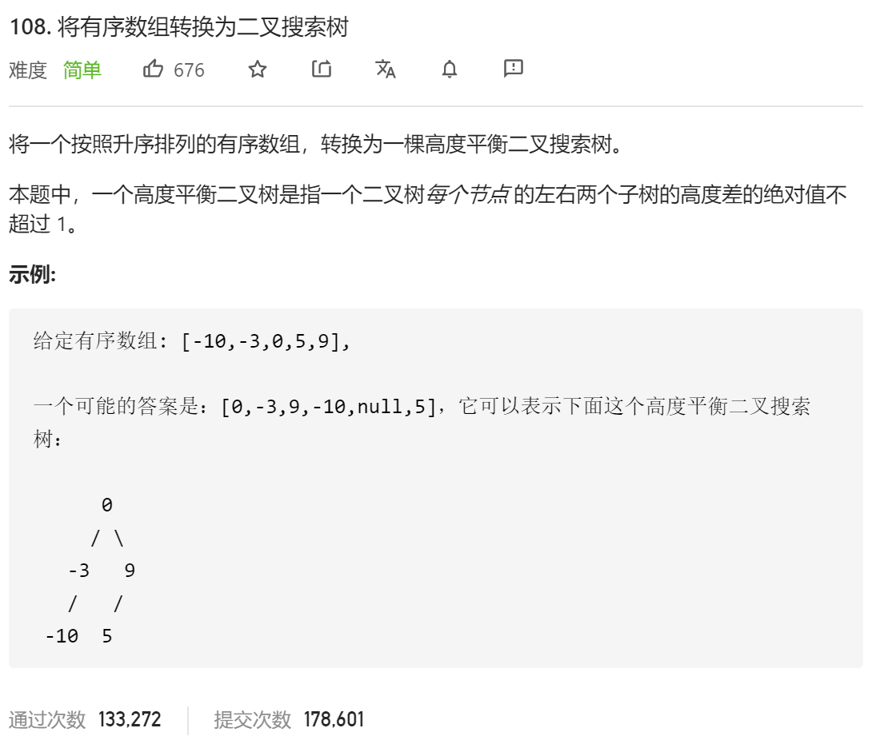

### leetcode_108_easy_将有序数组转换为二叉搜索树



```c++
class Solution {
public:
    TreeNode* sortedArrayToBST(vector<int>& nums) {
        
    }
};
```

#### 算法思路

**分治**算法，将数组拆分为根节点、左子树、右子树，再递归地处理左右子树

```c++
class Solution {
public:
	TreeNode* sortedArrayToBST(vector<int>& nums) {
		return buildBST(nums, 0, nums.size() - 1);
	}

	//使用数组的[left,right]区间，构造二叉搜索树
	TreeNode* buildBST(vector<int>& nums, int left, int right)
	{
		int mid;
		TreeNode* result;
		if (left > right)
			return nullptr;
		mid = (left + right) / 2;
		result = new TreeNode(nums[mid]);
		result->left = buildBST(nums, left, mid - 1);
		result->right = buildBST(nums, mid + 1, right);
		return result;
	}
};

```

